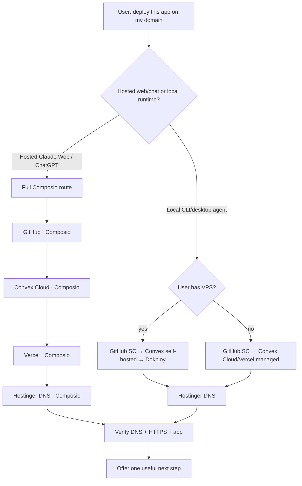

# SI-Coder

> **Tell SI-Coder what web app you want. It handles the path to a working live website.** Technical infrastructure is chosen and managed behind the scenes.

SI-Coder has three cooperating layers:

1. **Agent Skills** — `skills/` is the portable behavior/instruction SSOT.
2. **SC** — local provider registry, profiles, secret-safe credential lifecycle, GitHub identity, and VPS operations.
3. **Composio connected accounts** — the execution boundary for hosted web/chat agents and the preferred managed-provider boundary for local no-VPS routes.

A provider credential should never need to be pasted into chat.

## For non-technical users

You do **not** need to know what Vercel, Dokploy, Convex, DNS, environment variables, or deployment pipelines are.

Start with the result you want:

```text
Buatkan web app booking untuk salon saya.
Ada login pelanggan dan admin, jadwal booking, lalu online-kan di booking.domainku.com.
```

SI-Coder should then:

1. understand the product you want,
2. choose sensible technical defaults,
3. build or update the app,
4. ask you to connect an account only when permission is actually needed,
5. publish it,
6. connect your domain,
7. verify the website works,
8. recommend one useful next improvement.

If you want implementation details, ask **"tampilkan detail teknis"**. They are intentionally secondary.


## How SI-Coder works behind the scenes (optional)

The normal entry point is `/sc-all`. The first branch is **where the agent is running**, before provider credentials.



| Runtime/branch | Frontend | Backend | Provider policy |
|---|---|---|---|
| **Hosted web/chat** | Vercel | Convex Cloud | **Full Composio**, including GitHub and Hostinger; no VPS/local SC required |
| **Local + no VPS** | Vercel | Convex Cloud | GitHub in SC; Vercel/Convex/Hostinger prefer Composio, SC fallback |
| **Local + VPS** | Dokploy | Convex self-hosted | GitHub/Dokploy/Convex in SC; Hostinger via Composio or SC |
| **Local + VPS hybrid** | Dokploy | Convex Cloud | explicit advanced option |

Hosted surfaces do **not** ask whether the user owns a VPS. Local runtimes ask once only when VPS ownership cannot already be inferred.


## Credential handoff contract

Whenever SI-Coder says a key is missing, it must show the full handoff, not just `MISSING`:

```text
Buat di      : https://provider.example/.../api-keys
Simpan via   : sc secret set <provider> <KEY>
Simpan di    : active SC profile (0600)
Lanjut       : sc doctor --providers <provider>
```

Hosted ChatGPT/Claude Web replaces the local store with the secure Composio connection URL/account. After each completed milestone SI-Coder emits exactly one `[rekomendasi]` block containing the next action, why it matters, prerequisites, and the opt-in continuation.

## Secret model

`sc` is a control plane, not a secret-printing CLI.

```bash
sc providers                     # metadata + status
sc secret list resend            # state/source only
sc secret get resend RESEND_API_KEY
sc secret set resend RESEND_API_KEY   # hidden terminal input
sc secret rm resend RESEND_API_KEY --yes
sc run -- <command>              # inject resolved profile into child
```

Rules:

- `sc secret get` **does not return plaintext**.
- `sc env` is disabled because printing exports would expose credentials.
- Secret creation/rotation uses hidden TTY, trusted stdin/env/file, or a provider connection flow.
- Preferred local storage: `~/.config/si-coder/profiles/<name>.env` mode `0600`.
- Custom provider metadata: `~/.config/si-coder/providers.json`, also `0600`, with **no credential values**.
- Audit records contain lifecycle metadata only.

For an agent/MCP client, `sc.secret.request` returns a secure handoff such as:

```text
sc secret set composio COMPOSIO_API_KEY
```

It never accepts a field containing the secret itself.

See [`skills/sc-provider/SKILL.md`](skills/sc-provider/SKILL.md) and [`references/provider-routing.md`](references/provider-routing.md).

## Composio routing

Provider routing depends on runtime:

| Provider | Hosted web/chat | Local no-VPS | Local + VPS |
|---|---|---|---|
| GitHub | **Composio** | **SC** | **SC** |
| Convex | **Composio / Cloud** | Composio preferred, SC fallback | SC/self-hosted |
| Vercel | **Composio** | Composio preferred, SC fallback | optional |
| Hostinger | **Composio** | Composio preferred, SC fallback | Composio or SC |
| Dokploy | n/a | n/a | **SC** |

A hosted SI-Coder skill is an orchestration policy over connector calls; it does not require a local `sc` binary or local vault. If Composio is unavailable in hosted mode, connect/enable it instead of asking for raw API keys.

For local runtimes, SC remains the local secret/control-plane boundary and can fall back when a managed provider connector is unavailable.

## Portable installation

The repository uses the open `SKILL.md` Agent Skills structure. The same skill directories are linked into different agent runtimes; there are no divergent copies.

### Claude Code plugin

```bash
git clone https://github.com/rahmanef63/si-coder-agent.git
cd si-coder-agent
claude --plugin-dir "$PWD"
```

Plugin assets:

- `.claude-plugin/plugin.json`
- `skills/*/SKILL.md`
- `.mcp.json` → bundled secret-safe `si-coder` MCP server

Standalone user-skill mode:

```bash
bash install.sh --agent claude
```

### Codex / ChatGPT local Agent Skills

```bash
bash install.sh --agent codex --with-mcp
```

Skills are linked to `~/.agents/skills`; the installer can register the local SI-Coder MCP server through `codex mcp`.

### Hermes / OpenClaw

```bash
bash install.sh --agent hermes
bash install.sh --agent openclaw
```

### Install everywhere or use a custom directory

```bash
bash install.sh --agent all
bash install.sh --skills-dir /path/to/agent/skills
```

See [`skills/sc-install/SKILL.md`](skills/sc-install/SKILL.md) and [`references/portable-skills.md`](references/portable-skills.md).

## Skill catalog

| Skill | Status | Purpose |
|---|---:|---|
| `/sc-all` | ✅ | One-prompt deploy; hosted full-Composio or local VPS/no-VPS branch; domain + verification + next action |
| `/sc-provider` | ✅ | Provider CRUD, secret-safe status/rotation handoff, audit, update, MCP boundary |
| `/sc-install` | ✅ | Portable Agent Skills/plugin installation |
| `/sc-help` | ✅ | Quick routing/reference card |
| `/sc-onboarding` | ✅ | Guided local SC credential setup |
| `/sc-git` | ✅ | GitHub repo + Actions/runner operations |
| `/sc-dokploy` | ✅ | Dokploy project/app/compose/domain CRUD |
| `/sc-convex` | ✅ | Convex self-hosted operations |
| `/sc-convex-cloud` | ✅ | Convex Cloud deployment helpers |
| `/sc-vercel` | ✅ | Vercel deployment/domain helpers |
| `/sc-cf` | ✅ | Cloudflare DNS operations |
| `/sc-sync` | ✅ | Tailscale file sync |
| `/sc-n8n` | ✅ | n8n CLI workflows/credentials |
| `/sc-resend` | 🚧 | Full email/domain/send automation; credential management is already in SC |
| `/sc-stripe` | 🚧 | Payments automation |
| `/sc-clerk` | 🚧 | Clerk provisioning |
| `/sc-supabase` | 🚧 | Supabase alternative backend |

## One-prompt deployment example

User intent:

> Deploy this project to `app.example.com`.

**Hosted Claude Web / ChatGPT-style execution:**

1. Detect hosted runtime; skip the VPS question.
2. Discover/connect Composio GitHub, Convex, Vercel, and Hostinger accounts.
3. Create/reuse the GitHub repo through Composio.
4. Create/reuse the Convex Cloud production backend.
5. Create/reuse the Vercel project and deploy production.
6. Attach **the exact requested domain** to Vercel.
7. Read Vercel's required DNS target and write/validate Hostinger DNS.
8. Verify deployment, domain, DNS, HTTPS, and public response.
9. Report the canonical URL.
10. Offer **one** useful next action with prerequisites.

**Local execution:** first determine whether the user has a VPS. VPS yes routes to Dokploy; VPS no routes to managed Vercel while keeping local GitHub identity in SC.

A good follow-up after deploy is contextual, for example:

> The site is live. The highest-value next step is transactional email for password reset/invites. I can configure Resend next; it needs a Resend account/API key and a verified sender domain. If you want, I’ll give you the secure connection/terminal handoff and continue.

This is proactive, not coercive: explain the value and prerequisites, then let the user opt in. Do not repeatedly suggest services that are already configured.

## `sc` command reference

```bash
# Route/deploy planning
sc deploy plan --runtime hosted --composio --json
sc deploy plan --runtime local --json          # may return ask-vps
sc deploy plan --runtime local --no-vps --composio
sc deploy plan --runtime local --vps

# Provider/credential state
sc providers [--json]
sc providers show <id>
sc providers create <id> --key <ENV_KEY>
sc providers update <id> ...
sc providers key-add <id> <ENV_KEY> ...
sc providers key-rm <id> <ENV_KEY> --yes
sc providers delete <id> --yes

sc secret list [provider] [--json]
sc secret get <provider> [ENV_KEY] [--json]
sc secret set <provider> [ENV_KEY]
sc secret rm <provider> [ENV_KEY] --yes
sc run -- <command>

# Identity/profile isolation
sc user add <name> [--from-shell]
sc user use <name>
sc user map <folder> <name>
sc user which

# Health/update
sc doctor [--providers a,b]
sc update --check
sc update
sc version --json
sc audit --json
```

`sc update` is fast-forward only. It refuses dirty, ahead, diverged, or detached checkouts; it never resets/stashes/rebases user work.

## Architecture

```text
si-coder-agent/
├── .claude-plugin/plugin.json     Claude Code plugin manifest
├── .mcp.json                      Claude plugin MCP declaration
├── .mso/functions.json            MSO function surface (same safe schemas)
├── bin/sc.js                      human/operator CLI
├── scripts/sc-agent.js            machine-facing safe adapter
├── scripts/sc-mcp.js              portable stdio MCP server
├── lib/deploy-route.js            pure VPS/managed route policy
├── lib/providers.js               built-in provider SSOT
├── lib/custom-providers.js        metadata-only provider extensions
├── lib/profiles.js                per-identity credential isolation
├── skills/                        portable Agent Skills SSOT
└── references/                    routing + portability policy
```

Provider-specific low-level libraries remain in `lib/` and `skills/sc-*`. `/sc-all` owns **when/where/how to route**; provider sub-skills own the mechanics.

## Security properties

- Secrets are not allowed in MCP tool input schemas.
- Agent adapter rejects fields named like `value`, `secretValue`, `tokenValue`, `apiKeyValue`, or `password` as defense in depth.
- Git URL credentials are not persisted.
- Profile/custom-provider/audit files are `0600`.
- `sc run` injects secrets directly into a child environment without SI-Coder printing them.
- Managed provider connections should be used server-side; do not decrypt a credential merely to copy it to another provider.
- Destructive provider/key deletion requires explicit confirmation.

## Development

```bash
npm test
npm run route -- --target auto --json
npm run mcp
npm pack --dry-run
```

License: MIT.
