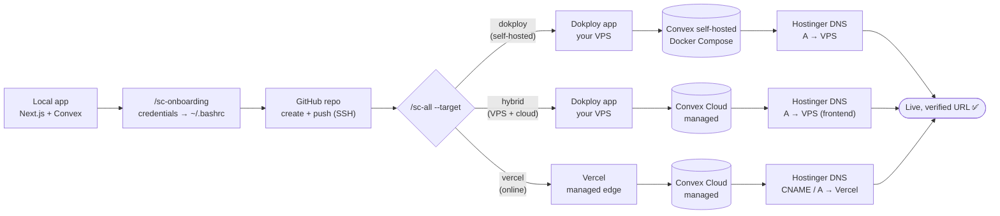
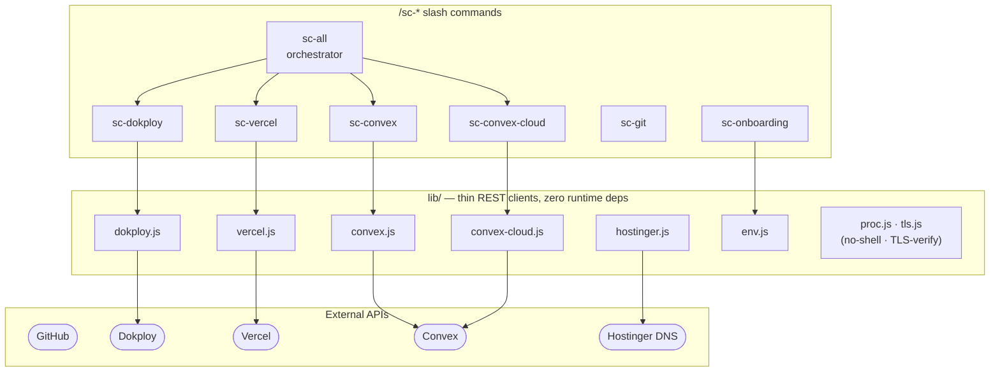

# SI Coder Agent

> Zero-human full-stack deployment as a bundle of `/sc-*` Claude Code slash commands — GitHub, Convex, Dokploy, Vercel, and DNS, all driven by an AI agent.

[](LICENSE)
[](https://nodejs.org)
[](#skill-catalog)
[](https://claude.com/claude-code)

**SI Coder Agent** is a modular set of `/sc-*` slash commands for Claude Code (and any agent that loads Skills) that take a local Next.js + Convex app from source to a live, verified URL with **zero human steps**. It creates the GitHub repo, pushes code, provisions the backend and frontend, wires up DNS, triggers the build, and polls until the site responds. Built for solo developers and agents who want to ship full stacks without clicking through dashboards. No runtime dependencies — just Node 18+ and your API tokens.

## Three deploy paths

All paths share the **same flow shape** — `GitHub → backend → frontend → DNS → verify` — and are driven by the same orchestrator. Pick by where you want things to run:

| | **(A) Self-hosted** | **(B) Hybrid** | **(C) Online** |
|---|---|---|---|
| Command | `/sc-all --target dokploy` (default) | `/sc-all --target hybrid` | `/sc-all --target vercel` |
| Frontend | Dokploy app (your VPS) | Dokploy app (your VPS) | Vercel |
| Backend | Convex self-hosted (Docker Compose on Dokploy) | Convex Cloud (managed) | Convex Cloud (managed) |
| DNS | Hostinger A-record → VPS | Hostinger A-record → VPS (frontend only) | Hostinger CNAME (sub) / A (apex) → Vercel |
| Pick when | You own the box, want full control, $0 marginal cost | You want your app on the box but the DB managed — no compose to babysit | You want a managed edge, no VPS to babysit |



## Skill catalog

After `bash install.sh`, these slash commands are available. **Implemented** commands do the work; **stubs** are boilerplate and exit with code `2` until someone fills them in (contributions welcome).

| Command | Status | What it does | Key env |
|---|---|---|---|
| `/sc-all` | ✅ | Orchestrator — end-to-end deploy; `--target dokploy\|hybrid\|vercel` | `GITHUB_TOKEN` + path env (below) |
| `/sc-help` | ✅ | Quick-reference card — every `/sc-*` command + the three deploy targets and their env | — |
| `/sc-dokploy` | ✅ | Dokploy CRUD/audit/debug: projects, apps, compose, domains, stale-domain audit | `DOKPLOY_API_URL`, `DOKPLOY_API_KEY` |
| `/sc-convex` | ✅ | Convex **self-hosted** on Dokploy: deploy, rotate admin key, JWT auth env, probe `api-/site-/dash-` | `DOKPLOY_*` (+ admin key) |
| `/sc-convex-cloud` | ✅ | Convex **Cloud** (managed) deploy; coupled build injects `NEXT_PUBLIC_CONVEX_URL`, probe `*.convex.cloud` | `CONVEX_DEPLOY_KEY` |
| `/sc-vercel` | ✅ | Vercel online frontend: GitHub-bound project, Convex-coupled build, custom domain/subdomain, Hostinger DNS | `VERCEL_TOKEN` (+`VERCEL_TEAM_ID` opt), `CONVEX_DEPLOY_KEY`, `HOSTINGER_API_TOKEN` (opt) |
| `/sc-git` | ✅ | GitHub repo CRUD + Actions cost reduction: audit burn, disable YAML, local CI, pre-push hook, self-hosted runner, commit status, VPS cron | `GITHUB_TOKEN` |
| `/sc-onboarding` | ✅ | Credential wizard — scans env, asks only for missing, writes `~/.bashrc` (merge-in-place). Non-AI: `node bin/onboard.js` | — |
| `/sc-sync` | ✅ | Tailscale rsync of gitignored files between VPS and local machine (same repo, shared via git, some docs kept out of `.gitignore`) | `SYNC_ROLE`, `SYNC_VPS_TS_ADDR`, `SYNC_LOCAL_TS_ADDR` |
| `/sc-cf` | 🚧 stub | Cloudflare — DNS A/AAAA/CNAME (Hostinger alt), Workers/Pages, R2, Zero Trust tunnel | — |
| `/sc-stripe` | 🚧 stub | Payments — products/prices, webhooks, customer portal, restricted keys | — |
| `/sc-resend` | 🚧 stub | Email — domain verify (DKIM/SPF/DMARC), API keys, template send | — |
| `/sc-clerk` | 🚧 stub | Auth (alt) — origins, JWT template for Convex, paired with Clerk MCP | — |
| `/sc-supabase` | 🚧 stub | Backend (alt) — project provision, migrations, edge functions, types gen | — |

## Quick start

```bash
git clone https://github.com/rahmanef63/si-coder-agent.git
cd si-coder-agent
bash install.sh        # symlinks skills/* (sc-*, use-si-coder, stubs) into ~/.claude/skills/
npm link               # puts the `sc` console on PATH (or just use `node bin/sc.js`)
sc setup               # interactive credential setup (non-AI)
source ~/.bashrc
```

> `sc` here is **this repo's console**, installed by `npm link` from the clone.
> Do **not** `apt install sc` — that is an unrelated Debian package (a terminal
> spreadsheet calculator). If you already did: `sudo apt remove sc`.

Driving via an AI agent instead? Just run `/sc-onboarding` — it scans your env, asks only for what's missing, and writes `~/.bashrc`.

**Deploy — self-hosted (Dokploy + Convex self-hosted):**

```bash
# Orchestrated (default target is dokploy):
/sc-all --target dokploy

# Or just the Convex self-hosted backend, standalone:
node skills/sc-convex/scripts/deploy-convex.js \
  --project myproj --app myapp --domain myapp.example.com --with-auth-keys
```

**Deploy — hybrid (Dokploy VPS frontend + Convex Cloud backend):**

```bash
# Same monolith as self-hosted, plus CONVEX_DEPLOY_KEY in env. Pushes the backend to
# Convex Cloud, then deploys the Dokploy app with NEXT_PUBLIC_CONVEX_URL = the cloud URL.
node scripts/deploy.js \
  --project myproj --app myapp --domain app.example.com --target hybrid

# Orchestrated:
/sc-all --target hybrid
```

No `docker-compose.yml` needed — the backend is managed. For a preview/project deploy key
(which doesn't carry the deployment name), also export `NEXT_PUBLIC_CONVEX_URL`. Only the
frontend domain gets DNS + a Dokploy domain; the backend lives on `*.convex.cloud`.

**Deploy — online (Vercel + Convex Cloud):**

```bash
# 1. Backend (Convex Cloud) — coupled build injects NEXT_PUBLIC_CONVEX_URL
node skills/sc-convex-cloud/scripts/deploy-cloud.js

# 2. Frontend (Vercel) + custom domain + Hostinger DNS + deploy
node skills/sc-vercel/scripts/deploy.js \
  --project myapp --app myapp --domain app.example.com \
  --git-owner <your-gh-user> --git-repo myapp --prod

# Or orchestrated — runs both, skips Dokploy + self-hosted Convex:
/sc-all --target vercel
```

The Vercel build command is set to `npx convex deploy --cmd 'npm run build' --cmd-url-env-var-name NEXT_PUBLIC_CONVEX_URL`. DNS is `CNAME → cname.vercel-dns.com` for a subdomain, `A → 76.76.21.21` for an apex (always read live from Vercel's domain config).

**Legacy one-shot** (monolith, still functional). Secrets are read **only from the environment** (`DOKPLOY_API_URL`, `DOKPLOY_API_KEY`, `GITHUB_TOKEN`) — never argv, so nothing leaks via `ps aux`. Only non-secret project/app/domain go on the command line:

```bash
# export DOKPLOY_API_URL / DOKPLOY_API_KEY / GITHUB_TOKEN in ~/.bashrc first
# cwd is the target app you want to deploy; the script path points at your
# si-coder-agent checkout (it imports ../lib/*, so it must run from the clone).
cd ~/projects/<app>
node ~/path/to/si-coder-agent/scripts/deploy.js --project "<PROJECT>" --app "<APP>" --domain "<DOMAIN>"
```

## Architecture

Each `/sc-*` skill is a `SKILL.md` + `scripts/` folder. All scripts share thin REST clients in `lib/`. CommonJS, Node 18+ native `fetch`, no runtime deps.



```
si-coder-agent/
├── SKILL.md           umbrella; points to sc-*
├── README.md
├── LICENSE             MIT
├── .env.example
├── install.sh         symlinks skills/* (sc-*, use-si-coder, stubs) into ~/.claude/skills/
├── lib/
│   ├── dokploy.js       Dokploy REST client + CRUD helpers
│   ├── hostinger.js     Hostinger DNS A/CNAME-record sync
│   ├── convex.js        admin key / schema deploy / JWT keys / probe
│   ├── convex-cloud.js  Convex Cloud deploy / URL derive / probe
│   ├── vercel.js        Vercel REST client + deploy/domain/DNS helpers
│   ├── proc.js          no-shell execFileSync wrappers
│   ├── tls.js           TLS verification helpers (always on)
│   └── env.js           env-string parse, merge, .bashrc append
├── skills/
│   ├── sc-all/SKILL.md
│   ├── sc-dokploy/
│   │   ├── SKILL.md
│   │   └── scripts/{_shared,projects,apps,compose,domains,audit,debug}.js
│   ├── sc-convex/
│   │   ├── SKILL.md
│   │   └── scripts/{deploy-convex,check-backend,rotate-admin-key,set-auth-env}.js
│   ├── sc-convex-cloud/
│   │   ├── SKILL.md
│   │   └── scripts/{deploy-cloud,check-cloud}.js
│   ├── sc-vercel/
│   │   ├── SKILL.md
│   │   └── scripts/{_shared,deploy}.js
│   ├── sc-git/SKILL.md + scripts/
│   ├── sc-onboarding/
│   │   ├── SKILL.md
│   │   ├── lib/onboarding-domains.js   single source: domain registry + validators
│   │   ├── scripts/scan-env.js
│   │   └── steps/{github,dokploy,convex,convex-cloud,hostinger,cf,stripe,resend,clerk,vercel,supabase,sync}.md
│   ├── sc-sync/SKILL.md + scripts/   Tailscale rsync of gitignored files (vps <-> local)
│   ├── use-si-coder/SKILL.md   vendored legacy-monolith doc (@convex-dev/auth lessons)
│   └── sc-{cf,stripe,resend,clerk,supabase}/   STUBS — boilerplate only
├── scripts/
│   └── deploy.js      legacy monolith (still functional)
├── test/
│   ├── deploy-helpers.test.js  pure helpers from scripts/deploy.js
│   ├── lib.test.js             lib/tls, lib/convex, lib/convex-cloud, lib/hostinger, lib/env
│   ├── resilience.test.js      fetch retry/backoff + bounded-timeout branches
│   ├── sc-git.test.js          sc-git helper coverage
│   ├── sc-sync.test.js         sc-sync route() + isBlockedPath()
│   └── vercel.test.js          lib/vercel DNS normalize + 409 disambiguation
└── bin/
    └── onboard.js     one-shot CLI wizard
```

## Security

Every skill (legacy `/use-si-coder` and all `/sc-*`) is adversarially audited and hardened:

- **No shell** — every external call uses `execFileSync` (no `sh -c`), so no command injection.
- **TLS always verified** — never disabled, even for self-signed probes.
- **No secret leaks** — tokens never appear in argv (`ps`-safe), logs, build args, or git URLs.
- **Redact-by-default inspection** — `sc-dokploy` `env`/`show` redact secrets by key **and** value-shape (+ URL userinfo), and mask non-`env` credential fields (`customGitUrl` PAT, registry password, SSH keys).
- **Validated env keys** — onboarding rejects non-identifier env-var names before writing `~/.bashrc` (no key-name shell injection).
- **Every external fetch bounded** — `AbortController` timeout + retry/backoff on 429/5xx across all REST clients, so a hung API can't stall a zero-human run.
- **`0600` secret files** — `~/.bashrc` and credential files are written owner-read/write only.
- **Shell-safe `~/.bashrc`** — values are single-quote escaped and merged in place.

## Development & tests

The canonical test entrypoint is:

```bash
npm test        # runs node --test --test-concurrency=1 "test/**/*.test.js"
```

`--test-concurrency=1` is not optional: run the files in parallel and Node 22's test
runner intermittently kills a random file with `uncaughtException: Unable to deserialize
cloned data due to invalid or unsupported version` (~50% of runs). That is the runner's
IPC channel corrupting, not our code — serial execution costs ~2s and is always green.

Use `npm test` (or `node --test test/deploy-helpers.test.js` for a single file). Avoid the
bare directory form `node --test test/` — on some Node versions it resolves `test/` as a
module entry and fails with `MODULE_NOT_FOUND` instead of discovering the `*.test.js` files.
Tests use only Node built-ins (`node:test` + `node:assert`); no extra dev deps.

### Releasing a version

`npm version` is the whole release flow — `preversion` runs the tests, npm bumps
`package.json` + commits + tags `vX.Y.Z`, and `postversion` pushes main with the tag.

```bash
npm version patch   # bugfix       0.3.0 -> 0.3.1
npm version minor   # new skill/feature
npm version major   # breaking change to an sc-* contract or env name
```

Failing tests abort the bump — nothing is committed, nothing is pushed.

## Core mandates (shared across all sc-*)

1. **Self-hosted Convex by default** — never silently swap to Clerk. Use `@convex-dev/auth`.
2. **`convex/_generated` committed** — never run codegen inside the Dockerfile.
3. **`npm install --yes --legacy-peer-deps`** — no interactive prompts.
4. **Idempotency** — duplicate domain create = no-op.
5. **Admin key sync** — Dokploy compose env + repo env file always match.
6. **Preserve your Dokploy control host** (the one in `DOKPLOY_API_URL`) — never rename it inside any script.
7. **Clerk MCP for Clerk apps** — `clerk` at `https://mcp.clerk.com/mcp`.
8. **Exact cloning** — replicate site layout, not a generic admin dashboard.

## Adding a new `/sc-*` domain

1. `mkdir skills/sc-<name>/{scripts}`
2. Write `skills/sc-<name>/SKILL.md` with frontmatter `name: sc-<name>` + `description:`.
3. Put scripts under `skills/sc-<name>/scripts/*.js`. Import shared utils from `../../../lib/`.
4. Add domain-required vars to `skills/sc-onboarding/lib/onboarding-domains.js` → `DOMAIN_VARS`.
5. Add a validator to `skills/sc-onboarding/lib/onboarding-domains.js` → `VALIDATORS` (single source of truth; `scripts/scan-env.js` and `bin/onboard.js` only import these).
6. Add a step doc at `skills/sc-onboarding/steps/<name>.md`.
7. Edit `install.sh` → add `link_skill "sc-<name>"`.
8. Re-run `bash install.sh`.

## FAQ

**Q: Site stuck loading?** Check your `Dockerfile` uses `ARG NEXT_PUBLIC_CONVEX_URL=<real-url>`, not a dummy.

**Q: Vercel build succeeds but app can't reach Convex Cloud?** The build command must be the coupled `npx convex deploy --cmd 'npm run build' --cmd-url-env-var-name NEXT_PUBLIC_CONVEX_URL` so the live deployment URL is injected at build time. `/sc-vercel` sets this for you.

**Q: Convex dashboard 401/404?** Run `/sc-convex` → `rotate-admin-key.js`. The admin key now lives in Dokploy compose env.

**Q: Dokploy shows old `*.traefik.me` domains?** Run `node skills/sc-dokploy/scripts/audit.js --fix`.

**Q: "Connection lost while action was in flight"?** See `skills/sc-convex/SKILL.md` — five common causes for self-hosted Dokploy.

**Q: `npx convex env set JWT_PRIVATE_KEY` errors on `--`?** Use `skills/sc-convex/scripts/set-auth-env.js` (REST API) instead.

## License

[MIT](LICENSE) — Created by Rahman EF.
