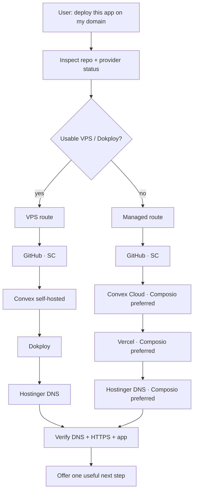

# SI-Coder

> Portable Agent Skills + MCP deployment control plane: one prompt from repository to a verified production domain, with automatic **VPS/Dokploy** or **managed Vercel** routing and a secret boundary designed for AI agents.

SI-Coder has three cooperating layers:

1. **Agent Skills** — the `skills/` directory is the portable behavior/instruction SSOT.
2. **SC** — local provider registry, profiles, secret-safe credential lifecycle, GitHub identity, and VPS operations.
3. **Connected provider tools** — on managed/no-VPS deployments, Composio-connected **Vercel, Convex, and Hostinger** accounts are preferred when available; SC remains the fallback.

A provider credential should never need to be pasted into chat.

## One prompt, two routes

The normal entry point is `/sc-all` or:

```bash
sc deploy plan --target auto
```

`auto` chooses the route from available capability instead of asking the user to understand the infrastructure first.



| Route | Frontend | Backend | Provider policy |
|---|---|---|---|
| **VPS** | Dokploy | Convex self-hosted | GitHub/Dokploy/Convex in SC; Hostinger via Composio or SC |
| **VPS hybrid** | Dokploy | Convex Cloud | explicit advanced option |
| **Managed / no VPS** | Vercel | Convex Cloud | GitHub in SC; Vercel/Convex/Hostinger prefer Composio |

GitHub is intentionally kept in SC by default so repo creation/push uses the intended local identity. A Composio GitHub connection can still be used for optional PR, issue, or release automation, but it is not silently substituted as the deployment source identity.

## Secret model

`sc` is a control plane, not a secret-printing CLI.

```bash
sc providers                     # metadata + status
sc secret list resend            # state/source only
sc secret get resend RESEND_API_KEY
sc secret set resend RESEND_API_KEY   # hidden terminal input
sc secret rm resend RESEND_API_KEY --yes
sc run -- <command>              # inject resolved profile into child
```

Rules:

- `sc secret get` **does not return plaintext**.
- `sc env` is disabled because printing exports would expose credentials.
- Secret creation/rotation uses hidden TTY, trusted stdin/env/file, or a provider connection flow.
- Preferred local storage: `~/.config/si-coder/profiles/<name>.env` mode `0600`.
- Custom provider metadata: `~/.config/si-coder/providers.json`, also `0600`, with **no credential values**.
- Audit records contain lifecycle metadata only.

For an agent/MCP client, `sc.secret.request` returns a secure handoff such as:

```text
sc secret set composio COMPOSIO_API_KEY
```

It never accepts a field containing the secret itself.

See [`skills/sc-provider/SKILL.md`](skills/sc-provider/SKILL.md) and [`references/provider-routing.md`](references/provider-routing.md).

## Composio routing

On a managed deployment, the skill should use connected provider tools rather than asking for raw provider API keys when possible.

Canonical policy:

| Provider | Default backend |
|---|---|
| GitHub deployment identity | **SC** |
| Dokploy / VPS | **SC** |
| Vercel, no-VPS route | **Composio preferred**, SC fallback |
| Convex Cloud, no-VPS route | **Composio preferred**, SC fallback |
| Hostinger DNS, no-VPS route | **Composio preferred**, SC fallback |
| Composio bootstrap key | SC only if a local connector needs it; otherwise use the host's native Composio connection |

SI-Coder deliberately does **not** proxy raw Composio/provider credentials through its MCP server. The orchestration skill coordinates the SI-Coder MCP namespace and the host's Composio connector. This keeps each credential inside the system that owns it.

## Portable installation

The repository uses the open `SKILL.md` Agent Skills structure. The same skill directories are linked into different agent runtimes; there are no divergent copies.

### Claude Code plugin

```bash
git clone https://github.com/rahmanef63/si-coder-agent.git
cd si-coder-agent
claude --plugin-dir "$PWD"
```

Plugin assets:

- `.claude-plugin/plugin.json`
- `skills/*/SKILL.md`
- `.mcp.json` → bundled secret-safe `si-coder` MCP server

Standalone user-skill mode:

```bash
bash install.sh --agent claude
```

### Codex / ChatGPT local Agent Skills

```bash
bash install.sh --agent codex --with-mcp
```

Skills are linked to `~/.agents/skills`; the installer can register the local SI-Coder MCP server through `codex mcp`.

### Hermes / OpenClaw

```bash
bash install.sh --agent hermes
bash install.sh --agent openclaw
```

### Install everywhere or use a custom directory

```bash
bash install.sh --agent all
bash install.sh --skills-dir /path/to/agent/skills
```

See [`skills/sc-install/SKILL.md`](skills/sc-install/SKILL.md) and [`references/portable-skills.md`](references/portable-skills.md).

## Skill catalog

| Skill | Status | Purpose |
|---|---:|---|
| `/sc-all` | ✅ | One-prompt deploy; auto VPS or managed route; domain + verification + next action |
| `/sc-provider` | ✅ | Provider CRUD, secret-safe status/rotation handoff, audit, update, MCP boundary |
| `/sc-install` | ✅ | Portable Agent Skills/plugin installation |
| `/sc-help` | ✅ | Quick routing/reference card |
| `/sc-onboarding` | ✅ | Guided local SC credential setup |
| `/sc-git` | ✅ | GitHub repo + Actions/runner operations |
| `/sc-dokploy` | ✅ | Dokploy project/app/compose/domain CRUD |
| `/sc-convex` | ✅ | Convex self-hosted operations |
| `/sc-convex-cloud` | ✅ | Convex Cloud deployment helpers |
| `/sc-vercel` | ✅ | Vercel deployment/domain helpers |
| `/sc-cf` | ✅ | Cloudflare DNS operations |
| `/sc-sync` | ✅ | Tailscale file sync |
| `/sc-n8n` | ✅ | n8n CLI workflows/credentials |
| `/sc-resend` | 🚧 | Full email/domain/send automation; credential management is already in SC |
| `/sc-stripe` | 🚧 | Payments automation |
| `/sc-clerk` | 🚧 | Clerk provisioning |
| `/sc-supabase` | 🚧 | Supabase alternative backend |

## One-prompt managed example

User intent:

> Deploy this project to `app.example.com`.

Expected orchestration when no VPS is usable:

1. Inspect the project and infer repo/project names.
2. `sc deploy plan --target auto --composio` → managed/Vercel.
3. Verify GitHub through SC; if missing, give the hidden `sc secret set github GITHUB_TOKEN` handoff.
4. Use connected Convex tools for the managed backend when available.
5. Create/reuse Vercel project and deployment through connected Vercel tools when available.
6. Attach **the exact requested domain** to Vercel.
7. Read the DNS configuration Vercel requires and write/validate that record in Hostinger.
8. Poll deployment/domain state and verify DNS, HTTPS, and public response.
9. Report the canonical URL.
10. Offer **one** useful next action, including prerequisites before the user opts in.

A good follow-up after deploy is contextual, for example:

> The site is live. The highest-value next step is transactional email for password reset/invites. I can configure Resend next; it needs a Resend account/API key and a verified sender domain. If you want, I’ll give you the secure connection/terminal handoff and continue.

This is proactive, not coercive: explain the value and prerequisites, then let the user opt in. Do not repeatedly suggest services that are already configured.

## `sc` command reference

```bash
# Route/deploy planning
sc deploy plan --target auto --json
sc deploy plan --target managed --composio
sc deploy plan --target vps

# Provider/credential state
sc providers [--json]
sc providers show <id>
sc providers create <id> --key <ENV_KEY>
sc providers update <id> ...
sc providers key-add <id> <ENV_KEY> ...
sc providers key-rm <id> <ENV_KEY> --yes
sc providers delete <id> --yes

sc secret list [provider] [--json]
sc secret get <provider> [ENV_KEY] [--json]
sc secret set <provider> [ENV_KEY]
sc secret rm <provider> [ENV_KEY] --yes
sc run -- <command>

# Identity/profile isolation
sc user add <name> [--from-shell]
sc user use <name>
sc user map <folder> <name>
sc user which

# Health/update
sc doctor [--providers a,b]
sc update --check
sc update
sc version --json
sc audit --json
```

`sc update` is fast-forward only. It refuses dirty, ahead, diverged, or detached checkouts; it never resets/stashes/rebases user work.

## Architecture

```text
si-coder-agent/
├── .claude-plugin/plugin.json     Claude Code plugin manifest
├── .mcp.json                      Claude plugin MCP declaration
├── .mso/functions.json            MSO function surface (same safe schemas)
├── bin/sc.js                      human/operator CLI
├── scripts/sc-agent.js            machine-facing safe adapter
├── scripts/sc-mcp.js              portable stdio MCP server
├── lib/deploy-route.js            pure VPS/managed route policy
├── lib/providers.js               built-in provider SSOT
├── lib/custom-providers.js        metadata-only provider extensions
├── lib/profiles.js                per-identity credential isolation
├── skills/                        portable Agent Skills SSOT
└── references/                    routing + portability policy
```

Provider-specific low-level libraries remain in `lib/` and `skills/sc-*`. `/sc-all` owns **when/where/how to route**; provider sub-skills own the mechanics.

## Security properties

- Secrets are not allowed in MCP tool input schemas.
- Agent adapter rejects fields named like `value`, `secretValue`, `tokenValue`, `apiKeyValue`, or `password` as defense in depth.
- Git URL credentials are not persisted.
- Profile/custom-provider/audit files are `0600`.
- `sc run` injects secrets directly into a child environment without SI-Coder printing them.
- Managed provider connections should be used server-side; do not decrypt a credential merely to copy it to another provider.
- Destructive provider/key deletion requires explicit confirmation.

## Development

```bash
npm test
npm run route -- --target auto --json
npm run mcp
npm pack --dry-run
```

License: MIT.
