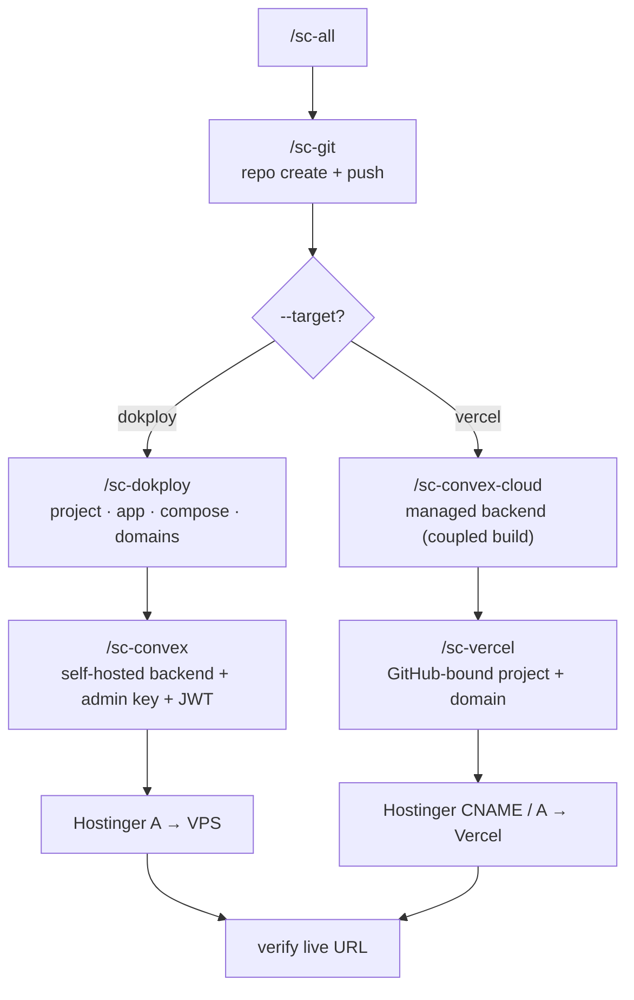

# si-coder-agent — Umbrella

This is the parent skill for the SI Coder family. After installing (see `install.sh`), the following slash commands are available:

**Implemented (7):**

| Command | Domain | Purpose |
|---|---|---|
| `/sc-all` | Orchestrator | End-to-end full-stack deploy; `--target dokploy` (default, self-hosted) or `--target vercel` (online) |
| `/sc-dokploy` | Dokploy | CRUD on projects/apps/compose/domains, audit, debug, stale-domain detection |
| `/sc-convex` | Convex self-hosted | Deploy on Dokploy, rotate admin key, set JWT auth env, probe `api-/site-/dash-` |
| `/sc-convex-cloud` | Convex Cloud | Managed Convex deploy; coupled build injects `NEXT_PUBLIC_CONVEX_URL`, probes `*.convex.cloud` |
| `/sc-vercel` | Vercel | Online frontend bound to a GitHub repo; build couples Convex Cloud deploy, custom domain/subdomain, Hostinger DNS (CNAME sub / A apex) |
| `/sc-git` | GitHub | Repo CRUD + Actions cost reduction (audit burn, disable YAML, local CI, pre-push hook, self-hosted runner, commit status, VPS cron) |
| `/sc-onboarding` | Setup | Scan env, prompt only for missing credentials, write to `~/.bashrc` (merge-in-place, single-quote escaped) |

### Two deploy paths (same flow shape)

- **(A) Self-hosted** — GitHub → Dokploy app + self-hosted Convex compose → Hostinger A-record → verify. `/sc-all --target dokploy`
- **(B) Online** — GitHub → Vercel frontend + Convex Cloud backend → Hostinger CNAME/A to Vercel → verify. `/sc-all --target vercel`



**Stubs (5, exit code 2 until implemented):** `/sc-cf` (Cloudflare), `/sc-stripe` (payments), `/sc-resend` (email), `/sc-clerk` (auth alt), `/sc-supabase` (backend alt).

The **legacy `/use-si-coder`** continues to work in parallel — it runs the monolithic `scripts/deploy.js` which still bundles GitHub + Dokploy + Convex + Hostinger DNS.

## Why modular?

- **Surgical ops** — change a Convex admin key without re-deploying the world
- **Discoverable** — `/sc-dokploy` makes Dokploy CRUD a first-class skill, not buried inside deploy.js
- **Composable** — `/sc-all` is the only consumer that pulls everything together
- **Onboarding-aware** — `/sc-onboarding` knows which `/sc-*` you ticked and asks for only what's missing

## CORE MANDATES (shared)

These apply across every sub-skill:

1. **Self-Hosted Convex by default**: never silently swap to Clerk. Use `@convex-dev/auth`.
2. **`convex/_generated` is committed**: don't run codegen inside Dockerfile.
3. **`npm install --yes --legacy-peer-deps`** — no interactive prompts.
4. **Idempotency**: duplicate domain creation = no-op, not error.
5. **Admin key sync rule**: Dokploy compose env + repo env file always match.
6. **Preserve your Dokploy control host** (the one in `DOKPLOY_API_URL`) — never rewrite it inside scripts.
7. **Clerk MCP for Clerk apps**: if target uses Clerk, preserve it; use Clerk MCP (`clerk` at `https://mcp.clerk.com/mcp`).
8. **Exact cloning**: if user wants a clone of an existing site, fetch and replicate layout, not a generic dashboard.

## Repo layout

```
si-coder-agent/
├── SKILL.md           ← this file
├── README.md
├── .env.example
├── install.sh         ← symlinks skills/* (sc-*, use-si-coder, stubs) into ~/.claude/skills/
├── lib/               ← shared modules
│   ├── dokploy.js     ← Dokploy REST
│   ├── github.js      ← GitHub REST + repo CRUD
│   ├── hostinger.js   ← Hostinger DNS (A/CNAME)
│   ├── convex.js      ← Convex self-hosted (Dokploy compose)
│   ├── convex-cloud.js← Convex Cloud (managed) deploy
│   ├── vercel.js      ← Vercel projects/domains/deploys
│   ├── proc.js        ← no-shell execFileSync process runner
│   ├── tls.js         ← TLS verification helpers (always on)
│   └── env.js         ← env scan + ~/.bashrc merge writer
├── skills/
│   ├── sc-all/SKILL.md
│   ├── sc-dokploy/{SKILL.md, scripts/}
│   ├── sc-convex/{SKILL.md, scripts/}
│   ├── sc-convex-cloud/{SKILL.md, scripts/}
│   ├── sc-vercel/{SKILL.md, scripts/}
│   ├── sc-git/{SKILL.md, scripts/}
│   └── sc-onboarding/{SKILL.md, scripts/, steps/}
├── scripts/
│   └── deploy.js      ← legacy monolith, still functional
└── bin/
    └── onboard.js     ← one-shot CLI wizard (no AI needed)
```

## Security posture (hardened 2026-06-14)

All `sc-*` skills: no-shell `execFileSync` (no command injection), TLS verification always on, no secrets in logs / build-args / git-URLs, `~/.bashrc` writes single-quote escaped. Requires **Node >=18** (native `fetch`), no runtime deps, CommonJS. Legacy one-shot `scripts/deploy.js` remains available.

## Deployment profile (placeholders only)

```bash
# GitHub
GITHUB_TOKEN=ghp_<your_token>

# Dokploy
DOKPLOY_API_URL=https://<your-dokploy-host>/api
DOKPLOY_API_KEY=<your_dokploy_api_key>

# Hostinger DNS (optional)
HOSTINGER_API_TOKEN=<your_hostinger_token>

# Clerk (only for explicitly-Clerk apps)
NEXT_PUBLIC_CLERK_PUBLISHABLE_KEY=pk_live_<clerk_publishable_key>
CLERK_SECRET_KEY=sk_live_<clerk_secret_key>
NEXT_PUBLIC_CLERK_FRONTEND_API_URL=https://<clerk-issuer-domain>

# Convex self-hosted (filled in by deploy)
CONVEX_SELF_HOSTED_URL=https://<convex-api-domain>
CONVEX_SELF_HOSTED_ADMIN_KEY=<convex_admin_key>
NEXT_PUBLIC_CONVEX_URL=https://<convex-api-domain>
NEXT_PUBLIC_CONVEX_SITE_URL=https://<convex-site-domain>
```

Never store real keys or live hostnames inside skill examples or agent instructions — always placeholders.
