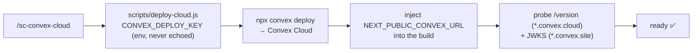

# /sc-convex-cloud — Convex Cloud (managed)

Use this skill when the user wants to deploy, debug, or maintain a **Convex Cloud (managed)** backend — the online-path counterpart to `/sc-convex` (self-hosted on Dokploy). The repo lives at `https://github.com/rahmanef63/si-coder-agent`.



## Connection-safe local execution

For a direct Convex Cloud `source=sc` named connection, execute credential-dependent helpers through `sc run -- ...`, for example:

```bash
sc run -- node skills/sc-convex-cloud/scripts/deploy-cloud.js --help
```

The plain `node scripts/...` examples below describe the script interface. Do not export `CONVEX_DEPLOY_KEY` globally merely to satisfy them. Composio-backed connections execute through Composio rather than `sc run`.

## NEVER ask the user to run Convex CLI by hand

Prefer an existing project-owned release wrapper because it owns environment isolation, custom domains and verification. Otherwise use `scripts/deploy-cloud.js`. **Do not** instruct the user to run `npx convex deploy` interactively, nor to hand-set `NEXT_PUBLIC_CONVEX_URL`. The deploy key is passed via the script's `env` and never echoed. If a deploy fails, debug it with `scripts/check-cloud.js` and fix root cause — do not punt the Convex CLI call to the user.

## Pre-requisites
- `CONVEX_DEPLOY_KEY` — production (or preview) deploy key for the Cloud deployment. **Required.**
- `CONVEX_DEPLOYMENT` — optional local-dev marker written by `npx convex dev`. **NOT used in CI.**

If `CONVEX_DEPLOY_KEY` is missing, route the user to `/sc-onboarding`.

## CORE MANDATES (LEARNED LESSONS)

1. **Respect the project's URL contract**: a coupled build may inject a deployment URL, but must not silently replace verified custom API/Auth domains. Read the active frontend adapter and release wrapper first.
2. **Use the actual adapter's public variable**: Next.js uses `NEXT_PUBLIC_CONVEX_URL`; other frameworks may use `PUBLIC_CONVEX_URL` or a compatibility bridge. Set `--cmd-url-env-var-name` only to the actual consumer.
3. **Deploy key is a secret**: never log/echo it. Pass it via the process `env`, never interpolate it into a shell command string.
4. **Set `CONVEX_DEPLOY_KEY` only on the matching env**: a prod key → Production only; a preview key → Preview only. Never set `CONVEX_DEPLOYMENT` in CI.
5. **Project + key creation is human-one-time**: there is no anonymous Cloud-project create API. Mint keys headlessly only after a first interactive login (`npx convex deployment token create <name> --prod --save-env`).

## Production selection and feature verification

Read the main sc delivery workflow for auth/email or domain changes.
Convex function env is separate from frontend-host env. Verify the exact
deployment and use `--prod` for production env/run operations that support it.
Do not shell-source dotenv or let ambient self-hosted/dev selectors override the
project release credential. Never dump env values during diagnosis.
Deploy the backend provider code, then verify a production capability query and
the actual UI/provider flow; redeploying only the frontend is insufficient.

## Required env vars

| Variable | Format | Purpose |
|---|---|---|
| `CONVEX_DEPLOY_KEY` | `prod:<name>\|eyJ2…` or `preview:…` | Authenticates `npx convex deploy` against the Cloud deployment (SECRET) |
| `CONVEX_DEPLOYMENT` | `prod:<name>` / deployment name | Optional local-dev marker only; leave blank in CI |

## Scripts

All scripts live in `skills/sc-convex-cloud/scripts/` (repo-relative; the usage blocks below assume this cwd). On install, this skill is symlinked into `~/.claude/skills/sc-convex-cloud/`, so the same paths resolve there too.

### `deploy-cloud.js`
Run a Convex Cloud deploy. Coupled build (default) runs the frontend build via `--cmd` and injects `NEXT_PUBLIC_CONVEX_URL`; `--backend-only` pushes just the backend (when Vercel runs the coupled build itself). Prints `NEXT_PUBLIC_CONVEX_URL=<url>` — never the deploy key.

```bash
node scripts/deploy-cloud.js \
  [--build-cmd 'npm run build'] \
  [--url-env NEXT_PUBLIC_CONVEX_URL] \
  [--backend-only] \
  [--message "deploy message"] \
  [--cwd <path>]
```

### `check-cloud.js`
Probe a Cloud deployment's `/version` (on the `*.convex.cloud` host) + `/.well-known/jwks.json` (on the `*.convex.site` host — that's where `@convex-dev/auth` serves JWKS). Derives the URL from `CONVEX_DEPLOY_KEY` when `--url` is omitted. Prints a status table. `/version` is required; JWKS is **advisory** (a deployment without `@convex-dev/auth` has none) and only gates the exit code when you pass `--expect-auth`. Exits 2 if a required probe is not ok.

```bash
node scripts/check-cloud.js --url https://<name>.convex.cloud
# require JWKS too (the deployment is expected to run @convex-dev/auth):
node scripts/check-cloud.js --url https://<name>.convex.cloud --expect-auth
# or, deriving from the prod deploy key:
node scripts/check-cloud.js
```

## Diagnosis

| Symptom | Cause | Fix |
|---|---|---|
| Client connects to wrong backend | `NEXT_PUBLIC_CONVEX_URL` not injected | Ensure `--cmd-url-env-var-name NEXT_PUBLIC_CONVEX_URL` is set on the coupled build |
| Browser shows `CONVEX_URL` unset | Missing `NEXT_PUBLIC_` prefix override | Pass `--url-env NEXT_PUBLIC_CONVEX_URL` (default) — never the bare `CONVEX_URL` |
| JWKS (`*.convex.site`) not 200 | `@convex-dev/auth` keys not configured on the deployment (or a probe pointed at the wrong host) | JWKS is served on `*.convex.site`, NOT `*.convex.cloud`; configure `@convex-dev/auth` keys on the deployment via the dashboard / env. Advisory unless `check-cloud.js --expect-auth` |
| `deploy-cloud.js` exits 1 immediately | `CONVEX_DEPLOY_KEY` missing | Set it (route to `/sc-onboarding`) — never run the CLI by hand |
| `check-cloud.js` cannot derive URL | preview key (branch-derived name not in key) | Pass `--url https://<name>.convex.cloud` explicitly |
