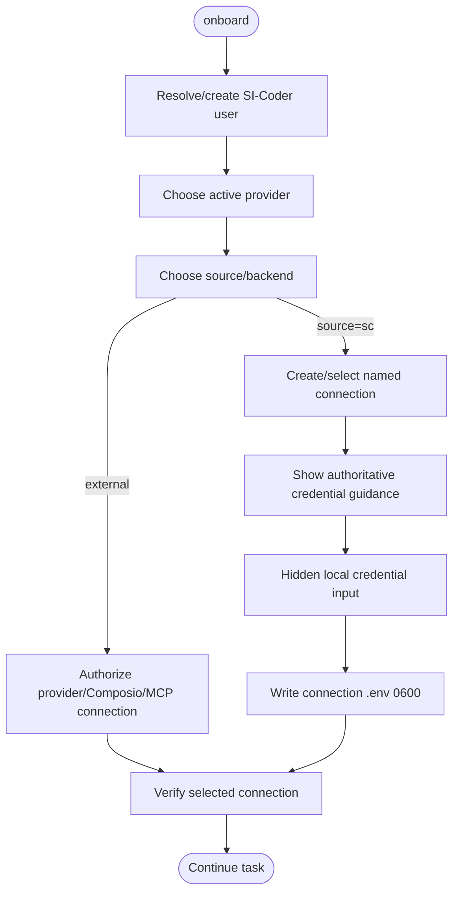

# /sc-onboarding — Guided credential setup

## Language

Keep durable instructions in English. **Reply in the user's language** unless they request another language.

> **Agent secret boundary:** never ask the user to paste an API key/token/password into chat, an MCP/function argument, or argv. Resolve `user → provider → connection` first. OAuth stays in the external connected-account flow; a direct new/rotated secret is entered with `sc user credential-set <user> <provider> <KEY> --connection <alias>` in the hidden terminal. Consume with `sc run [--connection provider=alias] -- <cmd>`.

Use this skill when the user is setting up `si-coder-agent` for the first time, or after they install a new `/sc-*` domain skill that needs new credentials.


## Non-technical default UX — mandatory

SI-Coder is primarily for people who want a working web app, not an infrastructure lesson. **Lead with the outcome, hide the plumbing.**

A valid user request can be as simple as:

> "Create a salon booking app and put it on my domain."

From that sentence, the agent should normally choose the stack, database/data service, hosting route, repository strategy, deployment method, domain records, and verification approach itself.

Rules:

1. **Speak in goals:** "publish the app", "connect the account", "connect the domain", "store the app data". Do not lead with terms such as environment variable, DNS record, deploy key, compose, container, build pipeline, or provider routing.
2. **One user action at a time.** Never dump a setup checklist when only one permission/account connection blocks progress.
3. **Do not ask users to choose technology** unless they explicitly care. Choose sensible defaults and keep the technology name in optional technical details.
4. **Do not ask a question that tools/repo state can answer.** Inspect first, then ask only the unresolved product/domain/account decision.
5. **Credentials are framed as permissions, not secrets.** Say "I need permission to use the email service" first. Then show the official create/connect action, where access is stored, and what SI-Coder will do next. Put env-key names and terminal commands under optional technical details unless the user must run the command.
6. **Never ask the user to copy values between services** when a connector/server-side flow can do it safely.
7. **Progress is product-oriented:** `Build the app → Prepare data → Publish → Connect domain → Verify`, not internal provider phases.
8. Every completion message must state what is now working and then offer exactly one `[rekomendasi]` next step.
9. Technical users can ask for "technical details", `--technical`, JSON, or provider-specific skills. Do not force those details on everyone else.

When a technical failure occurs, translate it first:

- preferred: "The domain is not connected yet. I am fixing the connection between the domain and the website."
- optional detail: "The CNAME does not match the hosting target yet."

Never hide a failure, but explain its user impact before its implementation detail.


## The `sc` console (preferred entry point)

```
sc providers                 what is configured, per provider
sc providers show <id>       per-var detail + where to get each value
sc providers set  <id>       re-enter (rotate) every var for one provider
sc providers rm   <id>       remove its vars from the ~/.bashrc managed block
sc setup [--target t]        interactive wizard for whatever is missing
sc doctor [--target t]       LIVE check — calls each real API
sc preflight --target t      the gate /sc-all runs
```

Everything that picks *something* is arrow-key driven — no retyping identifiers that are
already on screen, and no silent typos:

- **`sc`** with no arguments opens the console menu (on a pipe it still prints usage, so
  scripts are unaffected).
- **`sc setup`** shows a checkbox list of all providers with **no implicit selection**.
  `↑/↓` move · `Enter` chooses the highlighted provider when nothing is checked / confirms
  when boxes are checked · `Space` multi-select · `Ctrl-A` all/none · `←/→` tabs · type to
  search · `Esc` clear/cancel. This prevents an unrelated Needs-fix provider from being
  configured just because it was preselected behind the cursor.
- **`sc providers show|set|rm`** with no id opens a single-select list.

Values themselves are still typed — a token has to be pasted — but secrets are read hidden and never reach argv. In the Finder flow, `Esc` during a hidden or visible credential/metadata input cancels that input, saves nothing, and returns to the previous SC screen instead of quitting.

### More than one identity and more than one account

SI-Coder has two levels of identity:

```text
folder/project → user → provider → named connection
```

A user may have multiple labeled connections for the same provider. Example:

```text
rahmanfakhr
└─ convex-cloud
   ├─ Convex Admin        (Bearer token · account)
   ├─ Client A Production (API key · deployment)
   └─ Client B Preview    (API key · deployment)
```

Commands:

```bash
sc user add <name>
sc user map <folder> <name>
sc user which
sc user connections <name> [provider]
sc user connection-add <name> <provider> "<label>" --source <sc|composio|native-mcp> --auth <method>
sc user connection-use <name> <provider> <connection>
sc user connection-migrate <name> [provider]
```

Connection metadata is private but non-secret (`~/.config/si-coder/connections.json`, mode 0600). Only `source=sc` credential values live in one file per connection under `~/.config/si-coder/connections/<user>/<provider>/<connection>.env` (0600). Legacy user profile files remain readable only for compatibility/migration.

**Isolation rules:**

1. A resolved user outranks stale shell credentials.
2. Registry credentials not owned by that user are removed.
3. Within one provider, only one selected/default named connection is injected; fields from two connections are never merged.
4. A one-shot `sc run --connection provider=alias -- ...` override does not change the stored default.

`providers` answers "is it configured" (presence + format). `doctor` answers "does it
actually work" — a real call to the real API. A token can be perfectly well-formed and still
be revoked, expired, or belong to the wrong account; only the live call catches that, and it
also *names* what it reached (which GitHub login, which Cloudflare zones, which Vercel team),
which is how you catch a credential pointed at the wrong account.

The registry lives in `lib/providers.js`. Each var declares its own
required/secret/source/validator **plus credential source guidance** (`url`/`cmd`, `navigation[]`,
and `note`) inline. `DOMAIN_VARS` / `VALIDATORS` / `SECRET_SOURCES` are derived from it.
`lib/credential-guidance.js` is the renderer used by the Finder TUI, CLI onboarding, and agent
tool handoffs. `steps/<domain>.md` may add longer human context, but must not become a second
source of truth for where/how to obtain a credential.

## Current onboarding paths

### Mode A — agent-driven / Finder default

This is the canonical path. The agent MUST:

1. Resolve or create the SI-Coder **user** that owns the work. Do not start from global environment variables.
2. Inspect `user → provider → named connection` state with `sc.user.*` tools / `/sc-provider`.
3. Route only to an **active** capability. `skills/catalog.json` is the lifecycle SSOT; stub/legacy skills are not normal routing targets.
4. Choose the provider **source/backend** first. External OAuth/MCP sources keep credentials in that provider. Direct `source=sc` creates a named connection.
5. For a missing direct field, surface the provider SSOT guidance (`referenceUrl`/`createCommand`, `navigation[]`, scope) and hand the user to:

   ```bash
   sc user credential-set <user> <provider> <KEY> --connection <alias>
   ```

   The secret is entered in the hidden local terminal. The agent never receives it.
6. Verify the selected identity/connection with `sc user verify <user> [provider]` / `sc doctor`. A format-valid credential is not considered ready until the provider check is meaningful for that provider.

Fresh onboarding MUST NOT write provider secrets to `~/.bashrc`.



### Mode B — direct local CLI

```bash
bash install.sh                        # active skills only; offers `sc setup` on a TTY
bash install.sh --no-onboard           # install only; no prompt
sc setup                               # user → provider → named connection
sc setup --target dokploy              # same model, scoped to one deploy route
sc doctor
```

On a fresh machine `sc setup` creates/selects a local SI-Coder user, creates a named direct connection for each selected active provider, and stores values under `~/.config/si-coder/connections/<user>/<provider>/<connection>.env` with mode `0600`. It does not require `source ~/.bashrc`.

If old profile-scoped values for that provider exist, setup migrates them locally into a named connection before asking for new values.

### Legacy compatibility — explicit only

The old field-oriented helpers remain for migrations and old automation:

```bash
node bin/onboard-legacy.js
node bin/onboard-legacy.js --domains convex,dokploy,github
node skills/sc-onboarding/scripts/scan-env.js --domains github
```

Those helpers can read/write the historical managed `~/.bashrc` block. They are **not** the fresh-install path and must not be recommended when named connections are available. `sc user connection-migrate <user> [provider]` moves legacy profile values into named connections without printing them.

The `SECRET_SOURCES` ↔ `DOMAIN_VARS` registries remain in lockstep for compatibility and credential guidance. `scripts/scan-env.js --write-stdin` is retained only for trusted legacy automation; never pass a secret through argv.

## Required vars per domain

Mirrors `skills/sc-onboarding/lib/onboarding-domains.js` `DOMAIN_VARS` (the single source of truth).

| Domain | Required | Optional |
|---|---|---|
| github | `GITHUB_TOKEN` | — |
| dokploy | `DOKPLOY_API_URL`, `DOKPLOY_API_KEY` | — |
| convex | (uses dokploy creds) | `CONVEX_ADMIN_KEY` (auto-generated on deploy) |
| hostinger | — | `HOSTINGER_API_TOKEN` (recommended) |
| vercel | `VERCEL_TOKEN` | `VERCEL_TEAM_ID` |
| convex-cloud | `CONVEX_DEPLOY_KEY` | `CONVEX_DEPLOYMENT` |
| sync | `SYNC_ROLE`, `SYNC_VPS_TS_ADDR`, `SYNC_LOCAL_TS_ADDR` | `SYNC_REMOTE_USER`, `SYNC_REMOTE_PATH` |
| cf (Cloudflare DNS active) | — | `CLOUDFLARE_API_TOKEN`, `CLOUDFLARE_ACCOUNT_ID` |
| stripe (stub) | — | `STRIPE_SECRET_KEY`, `STRIPE_PUBLISHABLE_KEY`, `STRIPE_WEBHOOK_SECRET` |
| clerk (stub) | — | `CLERK_SECRET_KEY`, `NEXT_PUBLIC_CLERK_PUBLISHABLE_KEY`, `NEXT_PUBLIC_CLERK_FRONTEND_API_URL` |
| supabase (stub) | — | `SUPABASE_ACCESS_TOKEN`, `SUPABASE_ORG_ID` |
| resend | — | `RESEND_API_KEY`, `RESEND_FROM_DOMAIN` |
| composio | — | `COMPOSIO_API_KEY` |

Unfinished provider automations may keep credential schemas for explicit preparation, but normal setup/routing does not present them as working capabilities. Cloudflare DNS is implemented. Resend and Composio credential setup/doctor are implemented directly in the `sc` provider console even though dedicated Resend provisioning automation remains unfinished. See `steps/*.md` for how to obtain each value.

## Safety

- Never echo secrets back to the user — confirm with a capped preview only (at most the first ~25% of the value, max 4 chars) plus `…[len=N]`.
- Never overwrite an existing named-connection credential silently. Detect existing values and rotate only when requested.
- Legacy shell exports are migration inputs, not the canonical destination for new credentials.
- Keep unfinished provider schemas available for explicit preparation, but never present a stub automation as working.


## Relationship to Composio

This skill configures the **local SC store only**. It is not required for hosted Claude Web/ChatGPT-style deployments, which use full Composio connected accounts including GitHub. On a **local no-VPS** `/sc-all` route, GitHub stays SC-direct while Vercel/Convex/Hostinger prefer Composio when connected. Use `/sc-provider` for the canonical runtime/provider routing policy.

## Mandatory credential + next-step response contract

Whenever a credential/API key is missing, **never output only the variable name**. Always make the handoff explicit:

```text
Buat di      : <authoritative provider URL / secure connector auth link>
Petunjuk     : <minimum scope / exact menu when useful>
Connection  : <user/provider/label + scope>
Save with   : <sc user credential-set user provider KEY --connection alias, or secure provider connector>
Stored in   : <named SC connection 0600, or external connected account>
Lanjut       : <verification/resume action>
```

Rules:
- Local SC runtime: choose/create a labeled connection and use `sc user credential-set <user> <provider> <KEY> --connection <alias>` for direct credentials. Store values only in that connection's 0600 file; legacy profile/shell storage is migration-only.
- Hosted Claude Web/ChatGPT-style runtime: prefer the secure Composio connection URL returned by the connector; credentials stay in the connected account. Do not ask for the raw provider key unless the connector explicitly requires an API key bootstrap.
- If a custom API-key provider has no creation URL, do not guess one. Require its provider metadata to be updated with `--url https://...` first.
- Never put the credential value in chat, argv, logs, recommendations, or tool JSON.

After every meaningful completed milestone, emit exactly one next-step block:

```text
[rekomendasi]
Next        : <one highest-value next step>
Why         : <one sentence>
Needs       : <prerequisites, or "nothing from you yet">
If you want : <what SI-Coder will do next / secure auth handoff>
```

Do not dump multiple recommendations. Do not recommend something already configured and healthy.
