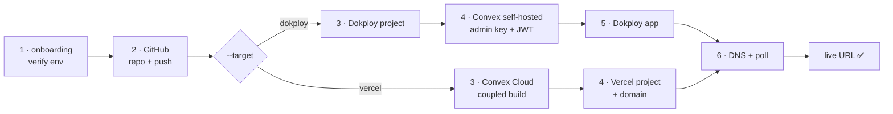

# /sc-all — Full-stack zero-human deployment

Use this skill when the user wants to ship a fresh project end-to-end in one command. This is the modular replacement for the legacy `/use-si-coder` monolith — both remain available in parallel.



## Pre-requisites

Required env (see `/sc-onboarding` if any are missing):
- `GITHUB_TOKEN`
- `DOKPLOY_API_URL`, `DOKPLOY_API_KEY`
- `HOSTINGER_API_TOKEN` (optional but recommended)

For `--target vercel` (online path): requires `VERCEL_TOKEN` + `CONVEX_DEPLOY_KEY` instead of
`DOKPLOY_*` (route to `/sc-onboarding --domains vercel,convex-cloud` if missing). `DOKPLOY_*` is
**not** required for this target. `HOSTINGER_API_TOKEN` stays optional for DNS.

The user's project directory must contain:
- A `Dockerfile` (for the frontend) — `ARG NEXT_PUBLIC_CONVEX_URL=...` pattern
- A `docker-compose.yml` (for Convex backend) — only if self-hosted Convex
- `convex/_generated/` committed (run `npx convex dev --once` first)

## CORE MANDATES

All mandates from `sc-convex` and `sc-dokploy` apply. Specifically:

1. **Self-Hosted Convex by default** — `@convex-dev/auth`, never Clerk unless requested.
2. **Build Safety** — `convex/_generated` committed; no codegen inside Dockerfile.
3. **No prompts** — `npm install --yes --legacy-peer-deps`.
4. **Idempotency** — duplicate domain creation = no-op; do not recreate existing services.
5. **Exact cloning** — if user wants a clone of an existing site, fetch and replicate layout.
6. **Admin Key Sync** — Dokploy env + repo env file always match.
7. **Preserve your Dokploy control host** (the one in `DOKPLOY_API_URL`) — never rename it inside any script.
8. **Clerk MCP for Clerk apps** — if target uses Clerk, preserve it; use Clerk MCP (`clerk` at `https://mcp.clerk.com/mcp`).

## Umbrella semantics

`/sc-all` is the **umbrella command**. Invoking it automatically pulls in every sub-skill below (sc-onboarding, sc-github, sc-dokploy, **sc-convex**, sc-git hook install). The user **never** needs to invoke `/sc-convex` separately — if `docker-compose.yml` is present, sc-convex is run as Phase 4. If a `convex/` dir is present without compose (existing self-hosted), sc-git's pre-push hook is installed so all subsequent pushes auto-deploy Convex without any manual command.

Concretely:
- Existing self-hosted project: `/sc-all` installs/refreshes the sc-git pre-push hook with Convex auto-deploy guard. After that, `git push` alone handles everything — backend deploys to Convex self-hosted first, then frontend rebuilds via Dokploy webhook. **Never instruct the user to run `npx convex deploy`, `pnpm convex:deploy`, or any Convex CLI command by hand.**
- Fresh deploy: `/sc-all` runs the full Phase 1–6 sequence below.

## Target selection (`--target dokploy|vercel`, default `dokploy`)

- `--target dokploy` (default): the existing Phase 1–6 flow (self-hosted Convex on Dokploy + Dokploy frontend app).
- `--target vercel` (online): skips Phase 3 Dokploy project, Phase 4 self-hosted Convex, and Phase 5 Dokploy application.
  Instead runs:
    Phase V4 — Convex Cloud: `sc-convex-cloud/scripts/deploy-cloud.js` (or let Vercel's coupled build do it).
    Phase V5 — Vercel frontend: `sc-vercel/scripts/deploy.js --project <P> --app <A> --domain <D> --git-owner <o> --git-repo <r> --prod`.
      This binds the GitHub repo, sets `CONVEX_DEPLOY_KEY`, sets the coupled build command, adds the domain,
      writes Hostinger DNS (CNAME for subdomain / A for apex from Vercel's required config), and polls the deploy.
    Phase V6 — Verify: `sc-convex-cloud/scripts/check-cloud.js` + the Vercel deployment readyState + custom-domain alias.

Phase 2 (GitHub) is shared across both targets.

## Orchestration

`/sc-all` walks through these phases. Each phase delegates to a sub-skill or shared library:

### Phase 1 — Onboarding gate
If any required env var missing → run `/sc-onboarding` first.

### Phase 2 — GitHub
- `lib/github.js` → `ensureRepo()` (create private repo if missing)
- `lib/github.js` → `pushLocalRepo()` (init/commit/push via SSH)

### Phase 3 — Dokploy project
- `lib/dokploy.js` → `findOrCreateProject(project)`
- Detect `Dockerfile` / `docker-compose.yml` to choose Application vs Compose path

### Phase 4 — Convex backend (if `docker-compose.yml` exists OR `convex/` dir exists)
Delegate to `sc-convex` AUTOMATICALLY — never wait for the user to type `/sc-convex`:
- Fresh project (compose): `scripts/deploy-convex.js --project <P> --app <A> --domain <D> --with-auth-keys`
- Existing self-hosted (just convex/): `node skills/sc-git/scripts/hook.js install --repo <name>` — installs the pre-push hook that auto-deploys Convex on every push that touches `convex/`. After install, the user just `git push` and the hook does `pnpm exec convex deploy --yes` against the self-hosted backend (CLI auto-detects from `.env.local`). Zero manual Convex commands forever.

### Phase 5 — Frontend application (if `Dockerfile` exists)
- `lib/dokploy.js` → `createApplication` if missing
- Bind to Dokploy GitHub provider if available, else raw Git URL
- Set `env` + `buildArgs` to inject `NEXT_PUBLIC_CONVEX_URL`
- Create main `<domain>` via `lib/dokploy.js` → `createDomain`
- `lib/dokploy.js` → `cleanupApplicationDomains` to remove stale duplicates / `traefik.me`
- `lib/dokploy.js` → `deployApplication` + poll until `applicationStatus === 'done' | 'error'`

### Phase 6 — Verify
- `sc-convex` → `scripts/check-backend.js` to probe `api-/site-/dash-` subdomains
- Print final URLs

## Quick run (legacy-compatible script)

The original monolith remains at `scripts/deploy.js`. It is still functional and parallel-supported:

```bash
# export DOKPLOY_API_URL / DOKPLOY_API_KEY / GITHUB_TOKEN (and optional
# HOSTINGER_API_TOKEN) in the environment first — secrets are read ONLY from
# env (never argv) so `ps aux` cannot leak them. Only non-secret
# project/app/domain go on the command line.
cd ~/projects/<app_name>
node ~/projects/opensource/si-coder-agent/scripts/deploy.js \
  --project "<PROJECT>" --app "<APP_NAME>" --domain "<DOMAIN>"
```

## Failure modes (where to look)

| Symptom | Where |
|---|---|
| `applicationStatus: error` | Dokploy dashboard → service → Deployments (logs are dashboard-only) |
| Convex auth crash | `sc-convex` SKILL — "Connection lost while action was in flight" table |
| DNS not resolving | `lib/hostinger.js` log output; check Hostinger portfolio coverage |
| Domain rejected | already exists, treat as no-op |
| `--` parsing breaks CLI | use `skills/sc-convex/scripts/set-auth-env.js` (REST), not `npx convex env set` |
