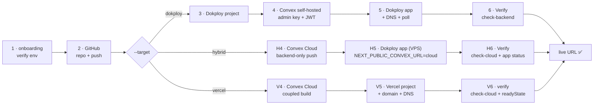

# /sc-all — Full-stack zero-human deployment

Use this skill when the user wants to ship a fresh project end-to-end in one command. This is the modular replacement for the legacy `/use-si-coder` monolith — both remain available in parallel.


```mermaid
flowchart LR
    P1["1 · onboarding<br/>verify env"] --> P2["2 · GitHub<br/>repo + push"]
    P2 --> T{"--target"}
    T -->|dokploy| D3["3 · Dokploy project"]
    D3 --> D4["4 · Convex self-hosted<br/>admin key + JWT"]
    D4 --> D5["5 · Dokploy app<br/>+ DNS + poll"]
    D5 --> D6["6 · Verify<br/>check-backend"]
    D6 --> Live["live URL ✅"]
    T -->|hybrid| H4["H4 · Convex Cloud<br/>backend-only push"]
    H4 --> H5["H5 · Dokploy app (VPS)<br/>NEXT_PUBLIC_CONVEX_URL=cloud"]
    H5 --> H6["H6 · Verify<br/>check-cloud + app status"]
    H6 --> Live
    T -->|vercel| V4["V4 · Convex Cloud<br/>coupled build"]
    V4 --> V5["V5 · Vercel project<br/>+ domain + DNS"]
    V5 --> V6["V6 · verify<br/>check-cloud + readyState"]
    V6 --> Live
```

**Three targets, one flow shape** (`GitHub → backend → frontend → DNS → verify`):

| `--target` | Frontend | Backend | Needs |
|---|---|---|---|
| `dokploy` (default) | Dokploy app (your VPS) | Convex **self-hosted** (compose on Dokploy) | `DOKPLOY_*` |
| `hybrid` | Dokploy app (your VPS) | Convex **Cloud** (managed) | `DOKPLOY_*` + `CONVEX_DEPLOY_KEY` |
| `vercel` | Vercel (managed edge) | Convex **Cloud** (managed) | `VERCEL_TOKEN` + `CONVEX_DEPLOY_KEY` |

`hybrid` = keep the app on the box you control, drop the self-hosted-DB babysitting. No `docker-compose.yml`, no admin-key rotation, no `api-/site-/dash-` backend subdomains — the backend is a managed `*.convex.cloud` deployment.

## Pre-requisites

## Phase 0 — PREFLIGHT (run this first, always)

```bash
sc preflight --target <dokploy|hybrid|vercel>
```

It reads the credential registry in `lib/providers.js` — the same source `sc setup` and
`sc doctor` use — and checks every var this target requires **before any side effect**.

- **On a TTY**: it offers to collect what is missing right there, writes the exports to the
  managed block in `~/.bashrc`, then exits **2** telling you to `source ~/.bashrc` and re-run.
  A child process cannot mutate its parent's environment, so re-running is not optional.
- **Not on a TTY** (CI, piped, `< /dev/null`): it never prompts. Prompting on a closed stdin
  does not ask a question, it hangs the job. It prints the exact command and exits **1**.

`scripts/deploy.js` enforces the same list independently, so a direct invocation cannot skip
the gate — it fails with the missing var names and `sc setup --target …` rather than a
generic usage wall.

Exit codes: `0` ready · `1` missing/refused · `2` written, re-source and re-run.

**Profiles apply here.** If `~/.config/si-coder/sc.md` maps the current directory to a
profile, `scripts/deploy.js` loads that profile's credentials **and unsets every registry
credential it does not own** before reading anything — so a folder bound to one identity
cannot deploy with another's leftovers still exported. It prints `👤 profile: <name>` and
what it ignored. `--no-profile` bypasses it. See `/sc-onboarding` for the full model.

Required env (see `sc setup`, or `/sc-onboarding`, if any are missing):
- `GITHUB_TOKEN`
- `DOKPLOY_API_URL`, `DOKPLOY_API_KEY`
- `HOSTINGER_API_TOKEN` (optional but recommended)

For `--target hybrid` (VPS frontend + Convex Cloud backend): requires `DOKPLOY_*` **and**
`CONVEX_DEPLOY_KEY` (route to `/sc-onboarding --domains github,dokploy,convex-cloud,hostinger`
if missing). No `docker-compose.yml` needed — the backend is managed.

For `--target vercel` (online path): requires `VERCEL_TOKEN` + `CONVEX_DEPLOY_KEY` instead of
`DOKPLOY_*` (route to `/sc-onboarding --domains vercel,convex-cloud` if missing). `DOKPLOY_*` is
**not** required for this target. `HOSTINGER_API_TOKEN` stays optional for DNS.

The user's project directory must contain:
- A `Dockerfile` (for the frontend, `dokploy`/`hybrid` targets) — `ARG NEXT_PUBLIC_CONVEX_URL=...` pattern
- A `docker-compose.yml` (for Convex backend) — **only** for `--target dokploy` (self-hosted); ignored by `hybrid`/`vercel`
- `convex/_generated/` committed (run `npx convex dev --once` first)

## CORE MANDATES

All mandates from `sc-convex` and `sc-dokploy` apply. Specifically:

1. **Self-Hosted Convex by default** — `@convex-dev/auth`, never Clerk unless requested. `--target hybrid`/`vercel` opt into managed Convex Cloud instead (still `@convex-dev/auth`).
2. **Build Safety** — `convex/_generated` committed; no codegen inside Dockerfile.
3. **No prompts** — `npm install --yes --legacy-peer-deps`.
4. **Idempotency** — duplicate domain creation = no-op; do not recreate existing services.
5. **Exact cloning** — if user wants a clone of an existing site, fetch and replicate layout.
6. **Admin Key Sync** — Dokploy env + repo env file always match.
7. **Preserve your Dokploy control host** (the one in `DOKPLOY_API_URL`) — never rename it inside any script.
8. **Clerk MCP for Clerk apps** — if target uses Clerk, preserve it; use Clerk MCP (`clerk` at `https://mcp.clerk.com/mcp`).

## Umbrella semantics

`/sc-all` is the **umbrella command**. Invoking it automatically pulls in every sub-skill below (sc-onboarding, GitHub repo create+push via `scripts/deploy.js` (inline `fetchGitHub` + `POST /user/repos`), sc-dokploy, **sc-convex**, sc-git hook install). The user **never** needs to invoke `/sc-convex` separately — if `docker-compose.yml` is present, sc-convex is run as Phase 4. If a `convex/` dir is present without compose (existing self-hosted), sc-git's pre-push hook is installed so all subsequent pushes auto-deploy Convex without any manual command.

Concretely:
- Existing self-hosted project: `/sc-all` installs/refreshes the sc-git pre-push hook with Convex auto-deploy guard. After that, `git push` alone handles everything — backend deploys to Convex self-hosted first, then frontend rebuilds via Dokploy webhook. **Never instruct the user to run `npx convex deploy`, `pnpm convex:deploy`, or any Convex CLI command by hand.**
- Fresh deploy: `/sc-all` runs the full Phase 1–6 sequence below.

## Target selection (`--target dokploy|hybrid|vercel`, default `dokploy`)

- `--target dokploy` (default): the existing Phase 1–6 flow (self-hosted Convex on Dokploy + Dokploy frontend app).

- `--target hybrid` (VPS frontend + Convex Cloud backend): keeps the frontend on Dokploy but swaps the
  self-hosted compose backend for a managed Convex Cloud deployment. Skips Phase 4 self-hosted Convex
  (no compose, no admin-key rotation, no `api-/site-/dash-` backend subdomains). Single-command:
  `scripts/deploy.js --project <P> --app <A> --domain <D> --target hybrid` handles it end-to-end. It runs:
    Phase H4 — Convex Cloud backend: `deployBackendOnly` (`npx convex deploy` with `CONVEX_DEPLOY_KEY` from
      env, never argv) pushes the backend to Convex Cloud, then derives the public `*.convex.cloud` URL
      (`deriveCloudUrl`) — for a preview/project key set `NEXT_PUBLIC_CONVEX_URL` in env instead.
    Phase H5 — Dokploy frontend app (same machinery as Phase 5), but `NEXT_PUBLIC_CONVEX_URL` build arg =
      the Convex Cloud URL (NOT `api-<domain>`). Only the frontend domain gets Hostinger DNS + a Dokploy
      domain; the backend needs none (it lives on Convex's own hosts).
    Phase H6 — Verify: `sc-convex-cloud/scripts/check-cloud.js` (backend `/version` + JWKS) + the Dokploy
      `applicationStatus` poll + frontend liveness probe.

- `--target vercel` (online): skips Phase 3 Dokploy project, Phase 4 self-hosted Convex, and Phase 5 Dokploy application.
  Instead runs:
    Phase V4 — Convex Cloud: `sc-convex-cloud/scripts/deploy-cloud.js` (or let Vercel's coupled build do it).
    Phase V5 — Vercel frontend: `sc-vercel/scripts/deploy.js --project <P> --app <A> --domain <D> --git-owner <o> --git-repo <r> --prod`.
      This binds the GitHub repo, sets `CONVEX_DEPLOY_KEY`, sets the coupled build command, adds the domain,
      writes Hostinger DNS (CNAME for subdomain / A for apex from Vercel's required config), and polls the deploy.
    Phase V6 — Verify: `sc-convex-cloud/scripts/check-cloud.js` + the Vercel deployment readyState + custom-domain alias.

Phase 2 (GitHub) is shared across all three targets.

## Orchestration

`/sc-all` walks through these phases. Each phase delegates to a sub-skill or shared library:

### Phase 1 — Onboarding gate
If any required env var missing → run `/sc-onboarding` first.

### Phase 2 — GitHub
- `scripts/deploy.js` → `fetchGitHub('/repos/<owner>/<name>')`, then `POST /user/repos` on 404 (create private repo if missing)
- git init/commit/push via SSH (`REPO_URL_RE`-guarded; `ensureGitignoreSafety` runs before `git add`)

### Phase 3 — Dokploy project
- `lib/dokploy.js` → `findOrCreateProject(project)`
- Detect `Dockerfile` / `docker-compose.yml` to choose Application vs Compose path

### Phase 4 — Convex backend (`--target dokploy`; if `docker-compose.yml` exists OR `convex/` dir exists)
Delegate to `sc-convex` AUTOMATICALLY — never wait for the user to type `/sc-convex`:
- Fresh project (compose): `scripts/deploy-convex.js --project <P> --app <A> --domain <D> --with-auth-keys`
- Existing self-hosted (just convex/): `node skills/sc-git/scripts/hook.js install --repo <name>` — installs the pre-push hook that auto-deploys Convex on every push that touches `convex/`. After install, the user just `git push` and the hook does `pnpm exec convex deploy --yes` against the self-hosted backend (CLI auto-detects from `.env.local`). Zero manual Convex commands forever.

**`--target hybrid` replaces this phase (H4)** with a Convex **Cloud** push — `deployBackendOnly` (`npx convex deploy` with `CONVEX_DEPLOY_KEY` via env) runs inside `scripts/deploy.js` before the frontend. Any `docker-compose.yml` is ignored; no admin key, no backend subdomains. Delegate to `sc-convex-cloud` for deeper Cloud ops.

### Phase 5 — Frontend application (if `Dockerfile` exists; `dokploy` + `hybrid`)
- `lib/dokploy.js` → `createApplication` if missing
- Bind to Dokploy GitHub provider if available, else raw Git URL
- Set `env` + `buildArgs` to inject `NEXT_PUBLIC_CONVEX_URL` — self-hosted → `https://api-<domain>`; **hybrid → the Convex Cloud URL** (H5)
- Create main `<domain>` via `lib/dokploy.js` → `createDomain`
- `lib/dokploy.js` → `cleanupApplicationDomains` to remove stale duplicates / `traefik.me`
- `lib/dokploy.js` → `deployApplication` + poll until `applicationStatus === 'done' | 'error'`

### Phase 6 — Verify
- `dokploy`: `sc-convex` → `scripts/check-backend.js` to probe `api-/site-/dash-` subdomains
- `hybrid`: `sc-convex-cloud` → `scripts/check-cloud.js` to probe `*.convex.cloud` `/version` + `*.convex.site` JWKS
- Print final URLs

## Quick run (legacy-compatible script)

The original monolith remains at `scripts/deploy.js`. It is still functional and parallel-supported:

```bash
# export DOKPLOY_API_URL / DOKPLOY_API_KEY / GITHUB_TOKEN (and optional
# HOSTINGER_API_TOKEN) in the environment first — secrets are read ONLY from
# env (never argv) so `ps aux` cannot leak them. Only non-secret
# project/app/domain/target go on the command line.
cd ~/projects/<app_name>

# self-hosted (default):
node ~/projects/opensource/si-coder-agent/scripts/deploy.js \
  --project "<PROJECT>" --app "<APP_NAME>" --domain "<DOMAIN>"

# hybrid — VPS frontend + Convex Cloud backend (also export CONVEX_DEPLOY_KEY):
node ~/projects/opensource/si-coder-agent/scripts/deploy.js \
  --project "<PROJECT>" --app "<APP_NAME>" --domain "<DOMAIN>" --target hybrid
```

The same monolith covers `--target dokploy|hybrid`. The `vercel` target is not run by this
script — it belongs to `sc-vercel/scripts/deploy.js` (the monolith rejects `--target vercel`
with a pointer). For a preview/project Convex key (which doesn't carry the deployment name),
export `NEXT_PUBLIC_CONVEX_URL` too so hybrid can wire the frontend to the right backend.

## Failure modes (where to look)

| Symptom | Where |
|---|---|
| `applicationStatus: error` | Dokploy dashboard → service → Deployments (logs are dashboard-only) |
| Convex auth crash | `sc-convex` SKILL — "Connection lost while action was in flight" table |
| DNS not resolving | `lib/hostinger.js` log output; check Hostinger portfolio coverage |
| Domain rejected | already exists, treat as no-op |
| `--` parsing breaks CLI | use `skills/sc-convex/scripts/set-auth-env.js` (REST), not `npx convex env set` |
| hybrid: `could not resolve the Convex Cloud URL` | preview/project deploy key — export `NEXT_PUBLIC_CONVEX_URL` (or `CONVEX_CLOUD_URL`); prod keys carry it |
| hybrid: `Convex Cloud backend deploy failed` | `sc-convex-cloud` SKILL — check `CONVEX_DEPLOY_KEY` + `convex/` present + CLI resolvable; re-run `deploy-cloud.js --backend-only` |
| hybrid: app up but can't reach backend | `NEXT_PUBLIC_CONVEX_URL` build arg wrong — must be the `*.convex.cloud` URL, never `api-<domain>` |

## Related Claude Code plugin skills (consult, don't duplicate)

The `sc-*` skills own **deploy orchestration**. For framework-level correctness of the code being
shipped, defer to the installed Claude Code plugin skills instead of re-deriving it here:

- **Convex** (`convex:convex-authz`, `convex:design`, `convex:domains`, + `convex-expert` / `convex-reviewer` agents):
  object-form function syntax, validators, index/query patterns, `@convex-dev/auth` wiring. Applies to
  **both** backends — self-hosted (`sc-convex`) and Cloud (`sc-convex-cloud`, used by `hybrid`/`vercel`).
- **Vercel / Next.js** (`vercel:nextjs`, `vercel:next-cache-components`, `vercel:deployments-cicd`, `vercel:shadcn`, …):
  App Router, Cache Components (PPR / `use cache`), build/CI. Applies to the `Dockerfile` build for the
  `dokploy`/`hybrid` frontend too, not just `--target vercel`.

Rule: `sc-*` decides **where** it runs and wires the secrets/DNS; the plugin skills decide **how the
code is written**. Pointer, not a copy — read the plugin skill live so it stays current.
