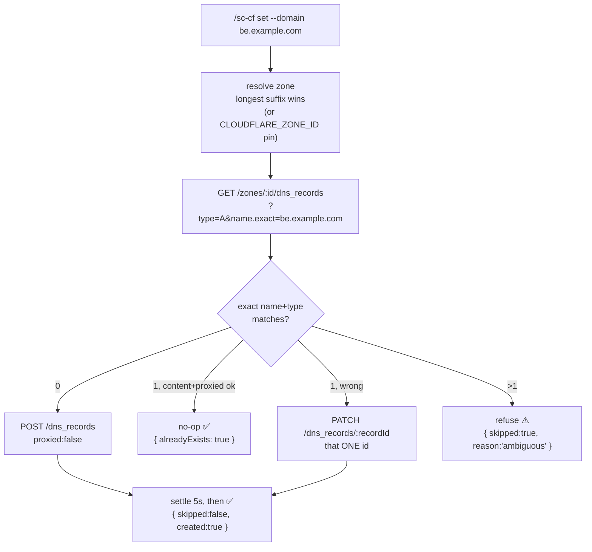

# /sc-cf — Cloudflare

> **Status:** **DNS is implemented** (`lib/cloudflare.js` + `scripts/dns.js`). Workers, Pages, R2 and Zero Trust tunnel are **not implemented** — see [Not implemented yet](#not-implemented-yet).



## When to use

- **The domain's nameservers point at Cloudflare.** That is the whole deciding factor — see [Hostinger vs Cloudflare](#hostinger-vs-cloudflare-which-provider-owns-the-zone).
- You need a subdomain A record so Traefik/Dokploy can obtain a Let's Encrypt certificate (the driving case).
- `/sc-all` needs a DNS provider and `CLOUDFLARE_API_TOKEN` is set — `configureDns` here is signature-compatible with `lib/hostinger.js`.

## Scope (implemented)

`lib/cloudflare.js` is the client; `skills/sc-cf/scripts/dns.js` is the CLI over it.

- **Zone resolution** — longest-matching-suffix probe (`GET /zones?name=<candidate>`, longest-first), so a delegated `sub.example.com` zone beats its parent. Falls back to paginated enumeration (`per_page=50`, hard cap 20 pages) when a token's listing ignores the name filter.
- **Idempotent record sync** — `configureDnsRecord` no-ops when the record already matches on content, `proxied` **and** `ttl`, PATCHes one record id when it doesn't, POSTs when it's absent. Never throws. An explicit `--ttl` on `set` is therefore applied to an otherwise-matching record (lowering TTL ahead of a planned cutover actually takes effect).
- **Target validation before anything destructive** — an `A` target must be a dotted-quad IPv4, `AAAA` an IPv6, `CNAME` a hostname. Checked *before* the zone lookup, so a malformed target costs no API call and — crucially — can never cost the clashing record that would have been deleted to make room for it. `TXT` content is arbitrary and is not shape-checked.
- **Recoverable clash removal** — when a clash is deleted and the replacement create then fails, the removed record is re-created (best effort) and the result carries `destroyed`/`restored`/`priorRecords`. `skipped: true` never silently means "a live record was destroyed".
- **Per-record CRUD** — `listRecords` / `createRecord` / `updateRecord` / `deleteRecord`, all bound by the same 15s abort timeout that stays armed across the body read. The unfiltered record listing is paginated (`per_page=100`, hard cap 20 pages) for the same reason zone enumeration is: a single page silently truncates, and `delete` would then report a record past row 100 as "not found in zone". An exact `name`+`type` lookup stays one request.
- **A↔CNAME clash handling** — removes the **one** clashing record found by an exact name+type lookup. TXT is exempt (SPF/DKIM/ACME challenges legitimately coexist).
- **`/sc-all` drop-in** — `configureDns({ fullDomain, dokployApiUrl })` resolves the Dokploy host to an IPv4 (`family:4` + dotted-quad guard) and writes the A record.

## Not implemented yet

| Area | Status |
|---|---|
| Workers deploy (`wrangler.toml`) | not implemented |
| Pages project + GitHub binding | not implemented |
| R2 bucket + access key provisioning | not implemented |
| Zero Trust / `cloudflared` tunnel | not implemented |

These need `CLOUDFLARE_ACCOUNT_ID` and account-scoped token permissions. DNS needs neither.

## Env vars

| Var | Required | Purpose |
|---|---|---|
| `CLOUDFLARE_API_TOKEN` | **yes** | Scoped API token. Minimum `Zone:Read` + `Zone:DNS:Edit`. Read from **env only**, never argv, never logged |
| `CLOUDFLARE_ZONE_ID` | optional | Pins the zone and **skips zone lookup entirely** — lets a token with only `Zone:DNS:Edit` (no `Zone:Read`) work. Announced on use so a stale export is visible |
| `CLOUDFLARE_ACCOUNT_ID` | **not needed for DNS** | Only for the unimplemented Workers/Pages/R2 surface. `dns.js` deliberately does not require it |

```bash
node bin/onboard.js --domains cf   # then: source ~/.bashrc
```

`CLOUDFLARE_ZONE_ID` is not part of the onboarding registry — export it by hand if you want the tighter single-permission token.

## Minting the API token

1. Go to **https://dash.cloudflare.com/profile/api-tokens** → **Create Token**.
2. Start from the **"Edit zone DNS"** template.
3. **Permissions** — the minimum for the full flow is two rows:
   - `Zone` → `DNS` → **Edit**
   - `Zone` → `Zone` → **Read**
4. **Zone Resources** → **Include** → **Specific zone** → `example.com`. Scoping to one zone means a bug cannot reach any other domain you own.
5. Copy the token once (it is never shown again) and put it in `CLOUDFLARE_API_TOKEN`.

> **The template gap that costs an hour:** "Edit zone DNS" grants `Zone:DNS:Edit` but **not** `Zone:Read`. Without `Zone:Read`, `GET /zones` answers `200 { success: true, result: [] }` — an empty list, *not* a 403 — so zone resolution reports "root zone not in account" for a zone that plainly exists. Either add the `Zone:Read` row, or set `CLOUDFLARE_ZONE_ID` and skip lookup. `node skills/sc-cf/scripts/dns.js zones` prints this exact diagnosis when it sees an empty list.

**Use a scoped token, never the Global API Key.** The Global Key is root-equivalent across every zone on the account. Auth here is `Authorization: Bearer <token>` only — no `X-Auth-Email` / `X-Auth-Key`. A token pasted into `~/.bashrc` keeps its trailing newline and Cloudflare answers `6111 Invalid format for Authorization header`, which reads like a bad token; the client `.trim()`s it for you.

## `proxied` — why it defaults to **false**

**`proxied` is `false` (grey cloud / "DNS-only") unless you explicitly pass `--proxied`.** It is sent explicitly on every write, never merely omitted, because the server-side default is not guaranteed to be grey.

With `proxied: true` (orange cloud) Cloudflare publishes its own anycast IPs instead of your origin IP and terminates TLS at its edge. For the driving use case — a subdomain where **Traefik on the VPS must obtain a Let's Encrypt certificate** — that breaks in three separate ways:

1. **HTTP-01 never reaches the origin.** Let's Encrypt fetches `http://<host>/.well-known/acme-challenge/<token>` and hits Cloudflare's edge. Traefik wrote the token on the VPS; Cloudflare has no idea it exists.
2. **The deadlock.** Cloudflare then fetches your origin over HTTPS (SSL mode Full / Full strict), but Traefik has no certificate yet — *because it is in the middle of trying to obtain one*. The origin fetch fails with **525/526** and the challenge fails. Retrying never resolves it: the cert can't issue until the origin serves a valid cert, and the origin can't serve one until the cert issues.
3. **TLS-ALPN-01 fails unconditionally.** Traefik's other default challenge needs the validator to complete a TLS handshake *with the origin*; the edge terminates it and the ALPN negotiation never arrives. No configuration fixes this while proxied.

Independently of TLS, **the proxy breaks self-hosted Convex.** Cloudflare applies idle timeouts and buffering to proxied connections, and Convex's reactive query model holds long-lived **websocket / long-poll** connections on `api-` and `site-`. Grey cloud is the only correct default for this bundle.

Guardrails in the code:

- The check is `proxied === true` — never `??`, never `!!`. The string `"false"` out of a config file or `--proxied=false` is *truthy*, and must not be able to turn the proxy on by accident. In the CLI only a bare `--proxied` or `--proxied=true` counts.
- Only `A`/`AAAA`/`CNAME` are proxiable; a stray `proxied: true` on `TXT`/`MX` is dropped rather than sent.
- `proxied: true` forces `ttl: 1` (Cloudflare rejects a numeric TTL on a proxied record); the client couples the two for you.
- **The idempotency check includes `proxied`.** A record left orange by an earlier run is treated as *not* already-correct and gets PATCHed back to grey — otherwise it would silently keep breaking cert issuance while the module cheerfully reported `alreadyExists: true`.
- Both `create` and `set` print a warning when you opt in.

**If you genuinely want the orange cloud**, switch Traefik to the **DNS-01** challenge — it validates via a TXT record and never touches port 80, so it works behind the proxy.

## Hostinger vs Cloudflare: which provider owns the zone?

**The deciding factor is which nameservers the domain actually delegates to — NOT which registrar sold it.** You can buy a domain at Hostinger and run its DNS on Cloudflare, or the reverse. Writing to the wrong provider's zone editor **silently does nothing**: the API returns `200 OK`, the record appears in that dashboard, and the record never resolves because the world is asking the *other* provider's nameservers.

Check before you write:

```bash
dig NS example.com +short
```

| Answer | Provider to use |
|---|---|
| `*.ns.cloudflare.com` | **`/sc-cf`** — this skill |
| `ns1.dns-parking.com`, `ns2.dns-parking.com` (Hostinger) | `lib/hostinger.js` / `scripts/hostinger-dns.js` |
| anything else | neither — that provider owns the zone |

Query the authoritative answer, not a cache, if you just changed delegation: `dig NS example.com @1.1.1.1 +short`. Nameserver changes take up to 48h to propagate; until they do, the *old* provider is still the live one.

Sanity-check afterwards — a record that resolves is the only proof that you wrote to the right place:

```bash
dig A be.example.com +short      # expect the VPS IP, not a Cloudflare anycast IP
```

If that returns `104.x` / `172.67.x`, the record is proxied (orange cloud) — see [`proxied`](#proxied--why-it-defaults-to-false).

## Safety: single records, never a whole zone

`lib/hostinger.js` is **destructive by design**: it GETs the entire zone as an array, mutates it in memory, and PUTs the *whole array* back. Any bug between the GET and the PUT — a bad filter, a truncated response, a mis-parsed body — writes a zone missing every record it failed to carry forward. The blast radius of any mistake there is the **entire domain**.

This implementation deliberately does not work that way. It uses **only** the per-record endpoints:

```
GET    /zones/{zone_id}/dns_records?type=&name.exact=     find
POST   /zones/{zone_id}/dns_records                       create one
PATCH  /zones/{zone_id}/dns_records/{dns_record_id}       update one
DELETE /zones/{zone_id}/dns_records/{dns_record_id}       remove one
```

The blast radius of a bug is **one record**. Keeping it that way is enforced in code, not by convention:

- `assertPerRecordWrite()` runs before **every** non-GET and refuses, before anything reaches the wire, any path that is not `/zones/:id/dns_records[/:recordId]`. The bulk endpoints `/batch`, `/import`, `/export` and `/scan` are unreachable by construction, not merely unused.
- **`PUT` is refused outright.** Cloudflare's `PUT` is "Overwrite DNS Record": fields omitted from the body revert to *defaults* rather than keeping their current value, so a content-only PUT can silently flip a grey-cloud record to proxied and drop its comment/tags. Only `PATCH` ("Edit") is allowed, and the full identifying set `{type, name, content, ttl, proxied}` is sent anyway.
- `PATCH`/`DELETE` without a record id is refused as "that is a whole-zone write"; `recordUrl()` refuses a falsy id so a path can never degenerate to `/dns_records/undefined`.
- **A record id is only ever taken from a `name.exact` + `type` lookup that is then re-verified client-side** (`rec.name === fqdn && rec.type === type`). Some Cloudflare API versions treat a bare `name=` as a *contains* filter — trusting the server filter alone is exactly how a write meant for `be.example.com` ends up PATCHing the apex `example.com`.
- **More than one match on name+type is a refusal, not a guess.** Round-robin A records are legal; picking one of N at random is not a decision this module makes on a live zone.
- The CLI's `delete` is **dry-run by default** (needs `--yes`), prints the record resolved from the zone's own listing before removing it, and refuses the zone apex without `--allow-apex` — including when `CLOUDFLARE_ZONE_ID` pins the zone, where the zone name is unknown and the apex root is taken from the `--zone` you typed. The apex A of a live zone is usually pointing at whatever the public site runs on.

Because writes are per-record, there is **no zone-backup ritual** the way `scripts/hostinger-dns.js` has one — there is nothing to restore.

## CLI

```
node skills/sc-cf/scripts/dns.js <command> [flags]
```

### The driving example — `be.example.com` → VPS IPv4, DNS-only

Create the A record a Dokploy panel needs so Traefik can get a Let's Encrypt cert at `https://be.example.com`:

```bash
export CLOUDFLARE_API_TOKEN=...   # never pass a token as a flag

node skills/sc-cf/scripts/dns.js set \
  --domain be.example.com --type A --target 203.0.113.10
```

```
🌍 Cloudflare DNS: ensure A 'be.example.com' -> 203.0.113.10 (DNS-only)
📝 POST A 'be.example.com' -> 203.0.113.10 in zone example.com...
✅ Cloudflare DNS updated for be.example.com
{ "skipped": false, "created": true }
```

No `--proxied`, so the record is grey cloud and the ACME HTTP-01 challenge on `:80` reaches Traefik. Re-run it and it no-ops (`{ "skipped": false, "alreadyExists": true }`) — it is safe in a loop. `set` resolves the zone itself; it needs no `--zone`.

### Commands

| Command | What it does |
|---|---|
| `zones` | List every zone the token can see (paginated; diagnoses an empty list as a missing `Zone:Read`) |
| `list` | Dump a zone's records as a table — run this before any write to get a rollback reference and record ids |
| `create` | Create one record. Fails if it already exists (use `set` for idempotency) |
| `delete` | Remove one record by id. **Dry run unless `--yes`** |
| `set` | **Idempotently ensure** one record: no-op / PATCH one id / POST. Never throws. Exits `1` on `{ skipped: true }` |

```bash
# which zones can this token see?
node skills/sc-cf/scripts/dns.js zones

# read the zone before writing to it
node skills/sc-cf/scripts/dns.js list --zone example.com
node skills/sc-cf/scripts/dns.js list --zone example.com --type A
node skills/sc-cf/scripts/dns.js list --zone example.com --type A --name be.example.com

# create explicitly (--name accepts a bare label or a full FQDN)
node skills/sc-cf/scripts/dns.js create \
  --zone example.com --type A --name be --content 203.0.113.10

node skills/sc-cf/scripts/dns.js create \
  --zone example.com --type CNAME --name www --content example.com --ttl 300

# idempotent ensure (the /sc-all-shaped call)
node skills/sc-cf/scripts/dns.js set --domain api-app.example.com --type A --target 203.0.113.10
node skills/sc-cf/scripts/dns.js set --domain app.example.com --type CNAME --target cname.vercel-dns.com

# delete: dry run first, then commit
node skills/sc-cf/scripts/dns.js delete --zone example.com --record-id <id>
node skills/sc-cf/scripts/dns.js delete --zone example.com --record-id <id> --yes

# opt into the orange cloud (you must switch Traefik to DNS-01 first)
node skills/sc-cf/scripts/dns.js set --domain www.example.com --type A --target 203.0.113.10 --proxied
```

### Flags

| Flag | Commands | Meaning |
|---|---|---|
| `--zone <root.tld>` | `list` `create` `delete` | Zone to operate on. `set` resolves the zone itself and does not take this |
| `--domain <fqdn>` | `set` | Full hostname to ensure, e.g. `be.example.com` |
| `--type <T>` | `list` `create` `set` | `A` \| `AAAA` \| `CNAME` \| `TXT`. `set` defaults to `A` |
| `--name <label\|fqdn>` | `list` `create` | Bare label (`be`) is expanded against the zone name; a full FQDN is used as-is. `@` expands to the apex |
| `--content <value>` | `create` | Record value. An `A` target is validated as a dotted-quad before it reaches the API |
| `--target <value>` | `set` | Same as `--content`, named to match the `lib/hostinger.js` CLI |
| `--ttl <seconds>` | `create` `set` | Default `1` = automatic (300s). Legal band is `1` or `60`–`86400`; anything else falls back to automatic |
| `--proxied` | `create` `set` | **Opt in to the orange cloud.** Off by default. Only a bare `--proxied` or `--proxied=true` counts |
| `--record-id <id>` | `delete` | Record id from `list`. Verified against the zone's own listing before deletion |
| `--yes` | `delete` | Actually delete. Without it the command is a dry run and exits `1` |
| `--allow-apex` | `delete` | Required to delete the zone apex record |

Exit codes: `set` exits `0` when something was written or was already correct, `1` when `skipped` (nothing written) — so `/sc-all`-style callers can branch. Everything else exits `0` on success, `1` on error.

## Library API

```js
const { configureDns, configureDnsRecord, makeClient } = require('./lib/cloudflare');
```

`configureDns` and `configureDnsRecord` **never throw** — they return a status object, whether you call the module export or `makeClient().configureDns*`. Consumers branch on `skipped` alone, so it is always present and always boolean:

| Return | Meaning |
|---|---|
| `{ skipped: true, reason: <string> }` | The record is **not** in place (bad args, malformed target, zone not found, ambiguous match, Cloudflare error, timeout) |
| `{ skipped: true, destroyed: true, restored, priorRecord, priorRecords, reason }` | A clashing record had to be removed and the replacement then **failed**. `restored` says whether the best-effort re-create put it back; `priorRecords` is the snapshot to re-create by hand if it didn't. `skipped` stays `true`, so every existing failure branch keeps working |
| `{ skipped: false, alreadyExists: true }` | Record already correct — content, `proxied` **and** `ttl` all match, nothing written, and that is success |
| `{ skipped: false, created: true }` | New record created |
| `{ skipped: false, created: true, updated: true }` | Existing record PATCHed. `created` stays set so no existing `.created` check regresses |

```js
// /sc-all drop-in — same call keys as lib/hostinger.js configureDns
await configureDns({ fullDomain: 'api-app.example.com', dokployApiUrl: process.env.DOKPLOY_API_URL });

// explicit record
await configureDnsRecord({ fullDomain: 'be.example.com', type: 'A', target: '203.0.113.10' });

// lower-level client
const cf = makeClient({});                       // token from CLOUDFLARE_API_TOKEN
await cf.verifyToken();                          // GET /user/tokens/verify
const z = await cf.resolveZone('be.example.com'); // { zoneId, zoneName, recordName } | { error }
await cf.listRecords({ zoneId: z.zoneId, name: 'be.example.com', type: 'A' });
```

Options on `configureDnsRecord`: `{ fullDomain, type, target, proxied = false, ttl = 1, zoneId, cloudflareToken, timeoutMs = 15000, settleMs = 5000, comment }`.
`configureDns` takes `{ fullDomain, dokployApiUrl, proxied = false, ttl = 1, zoneId, cloudflareToken, timeoutMs, settleMs }`.
Also exported for direct use: `resolveZone`, `listRecords`, `createRecord`, `updateRecord`, `deleteRecord`.

## File layout

```
sc-cf/
├── SKILL.md            (this file)
└── scripts/
    └── dns.js          # CLI: zones | list | create | delete | set

lib/cloudflare.js       # client + configureDns/configureDnsRecord (never-throws contract)
```

Planned, not implemented: `deploy-pages.js`, `deploy-worker.js`, `r2-bucket.js`, `tunnel.js`.

## Implementation notes

- **API base** `https://api.cloudflare.com/client/v4`; auth `Authorization: Bearer <CLOUDFLARE_API_TOKEN>`.
- **`res.ok` is not the success signal.** Every v4 response is `{ success, errors: [{code, message}], messages, result, result_info }`, and Cloudflare can answer HTTP 200 with `success: false`. Both are checked, and a non-JSON edge error page is handled rather than thrown on. Error text is capped at 300 chars so a huge body can't flood a log.
- **Every call is bounded by a 15s `AbortController` that stays armed across the body read** — a backend that sends headers then stalls the body is still bounded, not just the connect. Same pattern as `lib/hostinger.js`.
- **Record names are always full FQDNs.** Cloudflare names records by FQDN; for the apex the record name *is* the zone name. Passing Hostinger's `@` sentinel through would create a literal record called `@.example.com` — the single biggest translation trap between the two providers. The CLI expands `@` and bare labels for you.
- **`name.exact=` dot-notation**, not a bare `name=`, which is not in the current schema and behaves as a loose contains-filter on some versions.
- **Post-write settle:** 5s after a successful write, so the record reaches Cloudflare's resolvers before whatever asked for it (Traefik's ACME challenge) starts querying. Tunable via `settleMs`.
- **Cloudflare codes handled by name:** `81057` record-already-exists on POST is treated as success (another writer won the race — the end state is the one we asked for); `81044` on DELETE is success (already gone); `81053` is the A/CNAME host conflict; `7003` "could not route" means an empty zone/record id, i.e. our bug, and the URL builders make it unreachable.
- **Rate limit** is 1,200 requests / 5 min per user, cumulative across dashboard and API. There is no retry loop here on purpose — a write that may have partially succeeded is never retried.
- **Cross-skill:** when `/sc-all` needs DNS, prefer `sc-cf` if `CLOUDFLARE_API_TOKEN` is set *and* `dig NS` says the zone is on Cloudflare; otherwise fall back to `lib/hostinger.js`.
