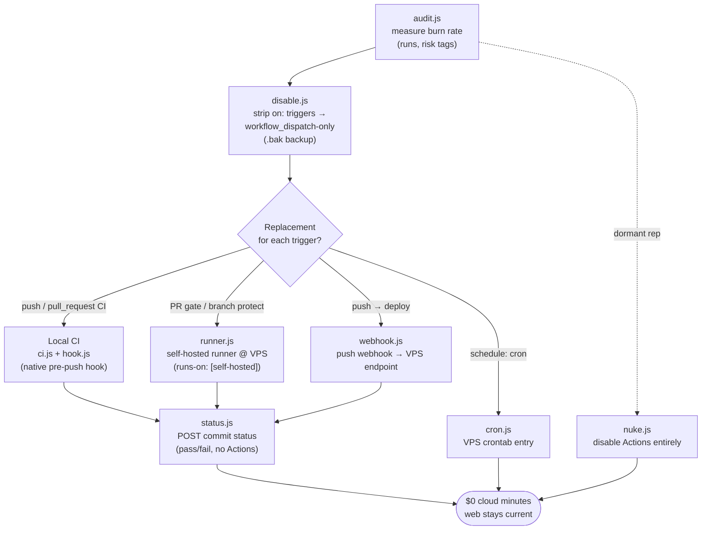

# /sc-git — GitHub Actions Replacement & Repo CRUD

Use when user wants to **stop GitHub Actions cloud minutes burn**, audit workflow files across your repos, migrate CI/CD to pre-push hooks + VPS, or do generic repo/workflow CRUD via `gh` API.

## Pre-requisites
- `gh` CLI authed with `repo` + `workflow` + `admin:repo_hook` scopes
- Local clones live in `~/projects/<repo>` (override with `PROJECTS_DIR`) (some repos remote-only — skill handles both)
- your VPS (set `SC_GIT_VPS_HOST`) accessible via SSH for runner/cron subcommands

## CORE RULES

1. **Never destructive without backup**: before patching any `.github/workflows/*.yml`, copy to `*.yml.bak`. Never delete `.bak` files.
2. **Never force-push, never push directly to main**: all changes land via new branch `chore/reduce-github-actions-usage`. PR is user's call.
3. **Never touch secrets / env / deploy targets**: skill only edits triggers (`on:`), `concurrency:`, `paths:`. Leaves `env:`, `secrets:`, `runs-on:`, job steps alone unless explicitly told.
4. **Never run failing workflows on cloud**: when listing recent runs, do not retrigger.
5. **Self-hosted runner only on private repos**: GitHub strongly recommends. If all your active repos are private, this is safe. Refuse runner setup if target repo `isPrivate === false`.
6. **`gh` CLI, not raw curl**: reuse the existing `gh` auth + scopes. Fall back to `gh api` for endpoints without dedicated subcommands.
7. **Idempotent**: re-running `disable` on already-disabled workflow is a no-op (detect existing `workflow_dispatch:` only + no `push:`/`pull_request:`/`schedule:`).

## Scripts

### `audit.js` — Sweep + report
Scans all your repos, lists workflows, recent run volume, identifies burn risks.

```bash
node scripts/audit.js                       # markdown report stdout
node scripts/audit.js --json                # machine-readable
node scripts/audit.js --since 2026-04-15    # custom window
node scripts/audit.js --repo <name>         # single repo
```

Output: per-repo trigger map, run count since window, risk tags (`cron`, `push-no-paths`, `pr-fanout`, `matrix-heavy`, `failing-burn`).

### `disable.js` — Strip auto-triggers
Patches workflow YAML so it only fires on `workflow_dispatch:`. Backs up to `.bak`. Creates branch `chore/reduce-github-actions-usage`, commits, leaves push to user.

```bash
node scripts/disable.js --repo <name>                    # all workflows in repo
node scripts/disable.js --repo <name> --workflow <file>  # one specific
node scripts/disable.js --repo <name> --dry-run          # diff only
```

### `nuke.js` — Disable Actions on repo (API)
Settings → Actions → "Disable actions". Use only for dormant repos.

```bash
node scripts/nuke.js --repo <name>          # disable
node scripts/nuke.js --repo <name> --revert # re-enable
```

### `ci.js` — Local CI runner
Detects package manager (pnpm/npm/yarn) + scripts, runs typecheck + lint + test + build in order. Equivalent to most repo `ci.yml`. Aborts on first failure.

```bash
node scripts/ci.js                           # current dir
node scripts/ci.js --repo <name>             # cd into ~/projects/<name>
node scripts/ci.js --skip lint,test          # skip steps
node scripts/ci.js --quiet                   # only show fail output
```

### `hook.js` — Native pre-push hook setup
Installs a native `.git/hooks/pre-push` (no husky dependency). Guard 1 always runs local CI via `node <skill>/scripts/ci.js --skip build` and aborts the push on failure. Guard 2 auto-deploys self-hosted Convex FIRST, but only when the repo has a `convex/` dir, `.env.local` exposes `CONVEX_SELF_HOSTED_URL` + `CONVEX_SELF_HOSTED_ADMIN_KEY`, and the pending commits touched `convex/` (silent no-op otherwise). Any existing pre-push hook is backed up to `pre-push.bak`.

```bash
node scripts/hook.js install --repo <name>
node scripts/hook.js uninstall --repo <name>
```

### `runner.js` — Self-hosted GH Actions runner
Registers a runner at your VPS (`SC_GIT_VPS_HOST`). Multi-repo via labels `[self-hosted, linux, x64]`. Free minutes forever.

```bash
node scripts/runner.js setup                          # bootstrap runner host
node scripts/runner.js register --repo <name>         # join repo
node scripts/runner.js list --repo <name>             # registered runners + their ids
node scripts/runner.js remove --repo <name> --id <id> # --id from `runner.js list --repo <name>`
```

### `status.js` — Commit status API
POST `repos/:o/:r/statuses/:sha` to mark a commit pass/fail without Actions. Useful for webhook-based CI.

```bash
node scripts/status.js --repo <name> --sha <sha> --state success --context ci
node scripts/status.js --repo <name> --sha <sha> --state failure --description "lint failed"
```

### `cron.js` — VPS crontab CRUD
Registers a cron entry on VPS that calls a skill or shell command. Replaces `schedule:` triggers.

```bash
node scripts/cron.js add --name notion-sync --schedule "0 19 * * 0" --cmd "..."
node scripts/cron.js list
node scripts/cron.js remove --name notion-sync
```

### `webhook.js` — GitHub webhook → VPS endpoint
Creates a `push` webhook pointing at VPS endpoint, so CI/deploy fires without Actions.

```bash
node scripts/webhook.js create --repo <name> --url <https://...>
node scripts/webhook.js list --repo <name>
node scripts/webhook.js delete --repo <name> --id <hookId>
```

## Migration Playbook

Standard order to move a repo off cloud Actions:

1. `node scripts/audit.js --repo <name>` — confirm what's burning.
2. `node scripts/hook.js install --repo <name>` — pre-push local CI.
3. `node scripts/disable.js --repo <name>` — strip auto-triggers (backup retained).
4. (Optional, if PR gate needed) `node scripts/runner.js register --repo <name>` then revert YAML `runs-on:` → `[self-hosted]`.
5. (Optional, for schedule:) move cron to VPS via `cron.js add`.
6. Verify: `gh api repos/<owner>/<name>/actions/runs?per_page=5 --jq '.workflow_runs[].name'` — should be empty for new pushes.

## Common patterns by repo type

| Repo type | Strategy |
|---|---|
| Solo dev, frontend (Next.js) | hook.js install + disable.js all + Dokploy webhook redeploy |
| Deploy-only YAML (SSH) | disable.js + replace with Dokploy auto-deploy webhook |
| Convex deploy | `/sc-convex push` di pre-push hook + disable.js |
| Cron sync (second-brain) | cron.js add (VPS) + disable.js |
| Multi-collaborator + branch protect | runner.js register + keep YAML `runs-on: [self-hosted]` |
| Dormant | nuke.js |

## Cost-reduction flow

How the subcommands compose to move a repo off GitHub Actions cloud minutes:



## Environment variables

These env vars change script behavior; each has a sensible default, so set only what you need to override.

| Variable | Default | Read by | Purpose |
|---|---|---|---|
| `GH_OWNER` | authed `gh` user (`gh api user`), else set `GH_OWNER` | `_shared.js` (all subcommands) | GitHub owner/org for every `gh api` call. |
| `PROJECTS_DIR` | `~/projects` | `_shared.js` (all subcommands) | Root dir scanned for local repo clones (`workflowFiles`, `localRepoPath`). |
| `SC_GIT_WEBHOOK_SECRET` | _(empty)_ | `webhook.js` (`create`) | HMAC secret for the created webhook. Read from env (or stdin) so it never lands on argv / shell history. |
| `SC_GIT_VPS_HOST` | `<your-vps-host>` | `runner.js` | SSH host where the self-hosted runner is bootstrapped/registered. Required for the runner subcommand. |
| `SC_GIT_RUNNER_HOME` | `~/actions-runner` | `runner.js` | Install path of the runner on the VPS. |
| `SC_GIT_RUNNER_VERSION` | `2.319.1` | `runner.js` | actions-runner release version to download during `setup`. |

`cron.js` reads no env vars — it edits the local crontab directly.

## Reference

- `gh api repos/{owner}/{repo}/actions/workflows` — list workflows
- `gh api repos/{owner}/{repo}/actions/runs` — list runs
- `gh api -X PUT repos/{owner}/{repo}/actions/permissions -f enabled=false` — disable Actions
- `gh api repos/{owner}/{repo}/actions/runners/registration-token` — runner token
- `gh api -X POST repos/{owner}/{repo}/statuses/{sha}` — commit status
- `gh api -X POST repos/{owner}/{repo}/hooks` — create webhook

## Linked skills
- `[[sc-dokploy]]` — Dokploy redeploy trigger (replaces deploy.yml)
- `[[sc-convex]]` — Convex self-hosted push (replaces convex-deploy.yml)
- `[[audit-bp]]` — local audit run (replaces audit-bp.yml)
