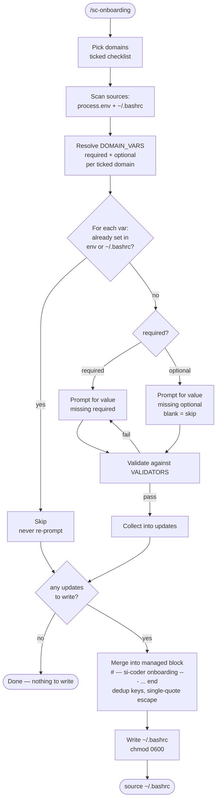

# /sc-onboarding — Guided credential setup

Use this skill when the user is setting up `si-coder-agent` for the first time, or after they install a new `/sc-*` domain skill that needs new credentials.

## Two modes

### Mode A — AI-driven (default, interactive)

Triggered when the user runs `/sc-onboarding` from Claude / OpenClaw / Gemini.

The AI MUST:
1. **Ask which domains they want.** Present a checklist (core deploy domains shown;
   see the "Required vars per domain" table below or `skills/sc-onboarding/lib/onboarding-domains.js`
   `DOMAIN_VARS` for the full list, including the stub domains):
   - `[ ] github` (always required for any deploy)
   - `[ ] dokploy` (Dokploy CRUD + deploy targets)
   - `[ ] convex` (Convex self-hosted)
   - `[ ] hostinger` (optional DNS automation)
   - `[ ] vercel` (Vercel online frontend)
   - `[ ] convex-cloud` (Convex Cloud backend)
   - `[ ] sync` (Tailscale rsync of gitignored files between VPS and local)
   - `[ ] cf` (Cloudflare, future) · `stripe` · `clerk` · `supabase` · `resend` (stubs)
2. **Run `scripts/scan-env.js --domains <list>`** to detect which required vars are already set in the user's environment (via `process.env` + `~/.bashrc` parse).
3. **For each missing var, prompt the user via `AskUserQuestion`** with the per-var description from `steps/<domain>.md`. NEVER ask for vars that are already set unless the user says "reset" or "rotate".
4. **Write only the new values** to `~/.bashrc` by piping the pairs via **stdin** so the raw secret never lands in argv (`ps aux` / `/proc/<pid>/cmdline` / shell history):

   ```bash
   printf 'KEY=VALUE\nKEY2=VALUE2\n' | node scripts/scan-env.js --write-stdin
   ```

   Each `KEY=VALUE` is validated against the shared `VALIDATORS` (same source of truth as the CLI wizard) before anything is written; on the first failure it prints `KEY failed validation` and exits 1 **without writing any pair** (all-or-nothing). A legacy argv form (`scripts/scan-env.js --write KEY=VALUE [KEY=VALUE...]`, pairs positional before or after the boolean `--write`) still exists for non-secret keys only — **never pass secrets as argv**. Both paths append an idempotent managed block delimited by `# --- si-coder onboarding ---` / `# --- end si-coder onboarding ---`; keys are deduped on each run and existing exports outside the block are not edited.
5. **Confirm**: `source ~/.bashrc` + tell the user which `/sc-*` skill they can now use.

NEVER ask the user to paste a value if it is already exported. Never log the value back to the user — confirm with a capped preview only (≤4 leading chars + `…[len=N]`).

## Flow



### Mode B — One-shot CLI (non-AI)

For users who clone the repo and want a scripted setup:

```bash
bash install.sh                        # symlink skills to ~/.claude/skills/
node bin/onboard.js                    # interactive readline wizard
node bin/onboard.js --domains convex,dokploy,github   # non-interactive checklist
```

The CLI (`bin/onboard.js`) reads `steps/<domain>.md` only for the human-readable prompt
text/context it shows per domain. The per-key **validators** are NOT in the step markdown —
they live in the `VALIDATORS` registry in `skills/sc-onboarding/lib/onboarding-domains.js`
(the same source of truth `scripts/scan-env.js` uses), which `bin/onboard.js` imports and
applies before writing to `~/.bashrc`.

## Required vars per domain

Mirrors `skills/sc-onboarding/lib/onboarding-domains.js` `DOMAIN_VARS` (the single source of truth).

| Domain | Required | Optional |
|---|---|---|
| github | `GITHUB_TOKEN` | — |
| dokploy | `DOKPLOY_API_URL`, `DOKPLOY_API_KEY` | — |
| convex | (uses dokploy creds) | `CONVEX_ADMIN_KEY` (auto-generated on deploy) |
| hostinger | — | `HOSTINGER_API_TOKEN` (recommended) |
| vercel | `VERCEL_TOKEN` | `VERCEL_TEAM_ID` |
| convex-cloud | `CONVEX_DEPLOY_KEY` | `CONVEX_DEPLOYMENT` |
| sync | `SYNC_ROLE`, `SYNC_VPS_TS_ADDR`, `SYNC_LOCAL_TS_ADDR` | `SYNC_REMOTE_USER`, `SYNC_REMOTE_PATH` |
| cf (stub) | — | `CLOUDFLARE_API_TOKEN`, `CLOUDFLARE_ACCOUNT_ID` |
| stripe (stub) | — | `STRIPE_SECRET_KEY`, `STRIPE_PUBLISHABLE_KEY`, `STRIPE_WEBHOOK_SECRET` |
| clerk (stub) | — | `CLERK_SECRET_KEY`, `NEXT_PUBLIC_CLERK_PUBLISHABLE_KEY`, `NEXT_PUBLIC_CLERK_FRONTEND_API_URL` |
| supabase (stub) | — | `SUPABASE_ACCESS_TOKEN`, `SUPABASE_ORG_ID` |
| resend (stub) | — | `RESEND_API_KEY`, `RESEND_FROM_DOMAIN` |

Stub domains pre-register vars so `/sc-onboarding` can collect them; their `/sc-*`
skills are not implemented yet. See `steps/*.md` for how to obtain each one.

## Safety

- Never echo secrets back to the user — confirm with a capped preview only (at most the first ~25% of the value, max 4 chars) plus `…[len=N]`.
- Never overwrite an existing export silently. Detect existing values, ask before rotating.
- The append block is a fixed, dedup-managed block delimited by `# --- si-coder onboarding ---` / `# --- end si-coder onboarding ---`, so the user can audit/remove it later.
