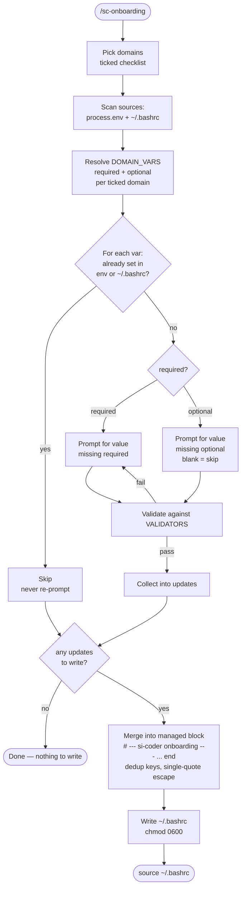

# /sc-onboarding — Guided credential setup

Use this skill when the user is setting up `si-coder-agent` for the first time, or after they install a new `/sc-*` domain skill that needs new credentials.

## The `sc` console (preferred entry point)

```
sc providers                 what is configured, per provider
sc providers show <id>       per-var detail + where to get each value
sc providers set  <id>       re-enter (rotate) every var for one provider
sc providers rm   <id>       remove its vars from the ~/.bashrc managed block
sc setup [--target t]        interactive wizard for whatever is missing
sc doctor [--target t]       LIVE check — calls each real API
sc preflight --target t      the gate /sc-all runs
```

Everything that picks *something* is arrow-key driven — no retyping identifiers that are
already on screen, and no silent typos:

- **`sc`** with no arguments opens the console menu (on a pipe it still prints usage, so
  scripts are unaffected).
- **`sc setup`** shows a checkbox list of all providers with whatever is incomplete
  **pre-ticked**. `↑/↓` move · `Space` toggle · `a` all/none · `Enter` confirm · `Esc` cancel.
  (`j`/`k` work too.)
- **`sc providers show|set|rm`** with no id opens a single-select list.

Values themselves are still typed — a token has to be pasted — but secrets are read hidden
and never reach argv.

### More than one identity: profiles + `sc.md`

One `~/.bashrc` holds one set of credentials. That breaks the moment two machines, two
Cloudflare accounts, or two clients are in play — and the failure is silent: a stale `export`
from a login shell is enough to deploy with the wrong account's token.

```
sc user                           profiles + which one governs this directory
sc user which                     the resolution, and why
sc user add <name> [--from-shell] create one (--from-shell imports what is exported now)
sc user use <name>                set the fallback profile
sc user map <folder> <name>       bind a folder AND its children to a profile
sc user unmap <folder>            drop that rule
sc user rm <name> [--yes]         delete a profile and its credentials
sc env                            eval "$(sc env)"  — apply it to the current shell
sc run -- <cmd> ...               run one command under the resolved profile
--no-profile                      ignore profiles for this one command
```

Credentials live in `~/.config/si-coder/profiles/<name>.env` (0600). The folder map lives in
`~/.config/si-coder/sc.md` — plain markdown, meant to be edited by hand:

```markdown
Active profile: `antinrml`

| Path | Profile |
| --- | --- |
| `~/projects/antinrml` | `antinrml` |
| `~/projects/client-x` | `client-x` |
```

**Longest matching path wins**, so a subdirectory can override its parent, and `/srv/app`
never matches `/srv/application` — matching is path-segment aware.

**Two rules that make this actually safe, both deliberate:**

1. **A profile OUTRANKS the shell.** The usual instinct is "the exported variable wins", but
   the failure modes are not symmetric: a profile losing to a stale export means deploying
   with someone else's credentials, while a profile winning means an intentional one-off is
   ignored — and `--no-profile` undoes that.
2. **Credentials the profile does not own are REMOVED, not merged.** Standing in a folder
   mapped to `client-x` with another account's `DOKPLOY_API_KEY` still exported, a merge
   would happily use it. Only registry keys are stripped; `PATH`, `HOME` and the rest survive.
   `sc env` emits `unset` lines for them, and every command prints what it ignored.

Backwards compatible: with no profiles, writes keep going to the `~/.bashrc` managed block
exactly as before. `sc user add <name> --from-shell` is the migration path.

`providers` answers "is it configured" (presence + format). `doctor` answers "does it
actually work" — a real call to the real API. A token can be perfectly well-formed and still
be revoked, expired, or belong to the wrong account; only the live call catches that, and it
also *names* what it reached (which GitHub login, which Cloudflare zones, which Vercel team),
which is how you catch a credential pointed at the wrong account.

The registry lives in `lib/providers.js`. Each var declares its own
required/secret/source/validator inline, and `DOMAIN_VARS` / `VALIDATORS` / `SECRET_SOURCES`
are derived from it — adding a provider means adding one object, and the three legacy maps
cannot drift from it again.

## Two modes

### Mode A — AI-driven (default, interactive)

Triggered when the user runs `/sc-onboarding` from Claude / OpenClaw / Gemini.

The AI MUST:
1. **Ask which domains they want.** Present a checklist (core deploy domains shown;
   see the "Required vars per domain" table below or `skills/sc-onboarding/lib/onboarding-domains.js`
   `DOMAIN_VARS` for the full list, including the stub domains):
   - `[ ] github` (always required for any deploy)
   - `[ ] dokploy` (Dokploy CRUD + deploy targets)
   - `[ ] convex` (Convex self-hosted)
   - `[ ] hostinger` (optional DNS automation)
   - `[ ] vercel` (Vercel online frontend)
   - `[ ] convex-cloud` (Convex Cloud backend)
   - `[ ] sync` (Tailscale rsync of gitignored files between VPS and local)
   - `[ ] cf` (Cloudflare, future) · `stripe` · `clerk` · `supabase` · `resend` (stubs)
2. **Run `scripts/scan-env.js --domains <list>`** to detect which required vars are already set in the user's environment (via `process.env` + `~/.bashrc` parse).
3. **For each missing var, prompt the user via `AskUserQuestion`** with the per-var description from `steps/<domain>.md`. NEVER ask for vars that are already set unless the user says "reset" or "rotate".
4. **Write only the new values** to `~/.bashrc` by piping the pairs via **stdin** so the raw secret never lands in argv (`ps aux` / `/proc/<pid>/cmdline` / shell history):

   ```bash
   printf 'KEY=VALUE\nKEY2=VALUE2\n' | node scripts/scan-env.js --write-stdin
   ```

   Each `KEY=VALUE` is validated against the shared `VALIDATORS` (same source of truth as the CLI wizard) before anything is written; on the first failure it prints `KEY failed validation` and exits 1 **without writing any pair** (all-or-nothing). A legacy argv form (`scripts/scan-env.js --write KEY=VALUE [KEY=VALUE...]`, pairs positional before or after the boolean `--write`) still exists for non-secret keys only — **never pass secrets as argv**. Both paths append an idempotent managed block delimited by `# --- si-coder onboarding ---` / `# --- end si-coder onboarding ---`; keys are deduped on each run and existing exports outside the block are not edited.
5. **Confirm**: `source ~/.bashrc` + tell the user which `/sc-*` skill they can now use.

NEVER ask the user to paste a value if it is already exported. Never log the value back to the user — confirm with a capped preview only (≤4 leading chars + `…[len=N]`).

## Flow


```mermaid
flowchart TD
    A([/sc-onboarding]) --> B[Pick domains<br/>ticked checklist]
    B --> C[Scan sources:<br/>process.env + ~/.bashrc]
    C --> D[Resolve DOMAIN_VARS<br/>required + optional<br/>per ticked domain]
    D --> E{For each var:<br/>already set in<br/>env or ~/.bashrc?}
    E -- yes --> F[Skip<br/>never re-prompt]
    E -- no --> G{required?}
    G -- required --> H[Prompt for value<br/>missing required]
    G -- optional --> I[Prompt for value<br/>missing optional<br/>blank = skip]
    H --> J[Validate against VALIDATORS]
    I --> J
    J -- fail --> H
    J -- pass --> K[Collect into updates]
    F --> L
    K --> L{any updates<br/>to write?}
    L -- no --> M([Done — nothing to write])
    L -- yes --> N[Merge into managed block<br/># --- si-coder onboarding --- ... end<br/>dedup keys, single-quote escape]
    N --> O[Write ~/.bashrc<br/>chmod 0600]
    O --> P([source ~/.bashrc])
```

### Mode B — One-shot CLI (non-AI)

For users who clone the repo and want a scripted setup:

```bash
bash install.sh                        # symlink skills, then OFFER the wizard (interactive TTY only)
bash install.sh --no-onboard           # symlink only; never prompt (CI / curl | bash)
node bin/onboard.js                    # run the interactive wizard on its own
node bin/onboard.js --domains convex,dokploy,github   # non-interactive checklist
```

`install.sh` chains into the wizard when run in an interactive terminal, so a fresh
clone goes from install to configured in one flow. It auto-skips when stdin/stdout
is not a TTY (piped installs), or with `--no-onboard`, so `curl … | bash` never hangs.

The wizard, for each missing var:

1. **Prints where to get it** — the dashboard URL (or a local command, e.g. `tailscale status`)
   plus a one-line hint (required scope, path within the dashboard, "leave blank"). These come
   from the `SECRET_SOURCES` registry in `skills/sc-onboarding/lib/onboarding-domains.js` — the
   single source of truth that `scripts/scan-env.js` also prints next to each MISSING var.
2. **Reads secrets without echoing them** — token-shaped values (`isSecret(key)`) are read in
   raw mode with no terminal echo, so nothing lands in scrollback. Public values (URLs, publishable
   keys, ids) stay visible. New vars default to hidden until registered (fail-closed).
3. **Validates** against the `VALIDATORS` registry (same file) before writing.
4. **Writes** only new values into the managed `~/.bashrc` block. Nothing is ever passed via argv,
   so no secret reaches `ps` / `/proc/<pid>/cmdline` / shell history.

The `SECRET_SOURCES` ↔ `DOMAIN_VARS` registries are kept in lockstep by
`test/onboarding-sources.test.js` — adding a var without a source (or vice versa) fails the suite.

## Required vars per domain

Mirrors `skills/sc-onboarding/lib/onboarding-domains.js` `DOMAIN_VARS` (the single source of truth).

| Domain | Required | Optional |
|---|---|---|
| github | `GITHUB_TOKEN` | — |
| dokploy | `DOKPLOY_API_URL`, `DOKPLOY_API_KEY` | — |
| convex | (uses dokploy creds) | `CONVEX_ADMIN_KEY` (auto-generated on deploy) |
| hostinger | — | `HOSTINGER_API_TOKEN` (recommended) |
| vercel | `VERCEL_TOKEN` | `VERCEL_TEAM_ID` |
| convex-cloud | `CONVEX_DEPLOY_KEY` | `CONVEX_DEPLOYMENT` |
| sync | `SYNC_ROLE`, `SYNC_VPS_TS_ADDR`, `SYNC_LOCAL_TS_ADDR` | `SYNC_REMOTE_USER`, `SYNC_REMOTE_PATH` |
| cf (stub) | — | `CLOUDFLARE_API_TOKEN`, `CLOUDFLARE_ACCOUNT_ID` |
| stripe (stub) | — | `STRIPE_SECRET_KEY`, `STRIPE_PUBLISHABLE_KEY`, `STRIPE_WEBHOOK_SECRET` |
| clerk (stub) | — | `CLERK_SECRET_KEY`, `NEXT_PUBLIC_CLERK_PUBLISHABLE_KEY`, `NEXT_PUBLIC_CLERK_FRONTEND_API_URL` |
| supabase (stub) | — | `SUPABASE_ACCESS_TOKEN`, `SUPABASE_ORG_ID` |
| resend (stub) | — | `RESEND_API_KEY`, `RESEND_FROM_DOMAIN` |

Stub domains pre-register vars so `/sc-onboarding` can collect them; their `/sc-*`
skills are not implemented yet. See `steps/*.md` for how to obtain each one.

## Safety

- Never echo secrets back to the user — confirm with a capped preview only (at most the first ~25% of the value, max 4 chars) plus `…[len=N]`.
- Never overwrite an existing export silently. Detect existing values, ask before rotating.
- The append block is a fixed, dedup-managed block delimited by `# --- si-coder onboarding ---` / `# --- end si-coder onboarding ---`, so the user can audit/remove it later.
