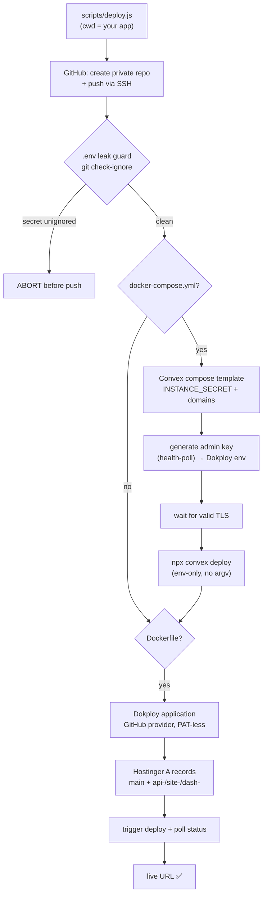

# SI Coder Auto Deploy (legacy `/use-si-coder`)

This skill automates the entire lifecycle of creating a GitHub repository and deploying full-stack apps to a Dokploy server via the single monolithic `scripts/deploy.js`. It is the original one-shot pipeline; the modular `/sc-*` skills (`/sc-all`, `/sc-dokploy`, `/sc-convex`, …) now cover the same ground in surgical pieces, but this monolith remains supported.

## CORE MANDATES FOR THE AI (LEARNED LESSONS)
To guarantee **Zero Human Involvement** (the user just wants to receive the final working URL):
1. **Self-Hosted Convex by Default**: NEVER use Clerk unless explicitly asked. ALWAYS use `@convex-dev/auth`. ALWAYS include a `docker-compose.yml` for self-hosting Convex alongside the frontend.
2. **Build Safety**: Do NOT run `npx convex codegen` inside the `Dockerfile`. You MUST generate the types locally (`npx convex dev --once`) and commit the `convex/_generated` folder to Git before deploying.
3. **No Prompts / Dependency Hell**: Always use `npm install --yes --legacy-peer-deps`. If a scaffolded template is too complex (bloated), wipe it and start fresh with `npx create-next-app` to avoid endless TypeScript errors.
4. **Exact Cloning**: If asked to clone a website, you MUST replicate its actual layout and structure, not just build a generic admin dashboard. Fetch the website to understand its structure.
5. **Dokploy Idempotency**: The deployment script handles existing apps, composes, and domains safely. Do NOT delete or recreate existing domains if Dokploy rejects them (it means they are already configured).
6. **Convex Admin Key Sync**: When generating or rotating a self-hosted Convex admin key, immediately update the Dokploy Compose environment and the repo's local env file so they stay in sync. Use the project's actual env name for that template or app, and do not invent a second secret name.
7. **Clerk MCP for Clerk Apps**: If a target project already uses Clerk, preserve it, do not swap it to `@convex-dev/auth`, and use Clerk MCP (`clerk` at `https://mcp.clerk.com/mcp`) for SDK snippets and integration patterns.

## Pre-requisites
1. **Dokploy Credentials**: Environment variables `DOKPLOY_API_URL` and `DOKPLOY_API_KEY` (usually stored in `~/.bashrc`).
2. **GitHub Credentials**: A GitHub Personal Access Token (PAT) with repository creation permissions, stored in the `GITHUB_TOKEN` environment variable.
3. **Hostinger Credentials**: `HOSTINGER_API_TOKEN` (optional but recommended for DNS automation). The script reads this directly from the environment.
4. **SSH Keys**: The machine must have SSH access to GitHub (`git@github.com`) configured for pushing code.

See the repo's `.env.example` for the full setup checklist.

## Workflow

When the user asks to deploy a project:

1. **Verify Credentials**: Check for `DOKPLOY_API_URL`, `DOKPLOY_API_KEY`, and `GITHUB_TOKEN` (and `HOSTINGER_API_TOKEN` if DNS automation is wanted).
2. **Docker Compose**: Ensure the project has a `docker-compose.yml` that defines the frontend, backend (Convex DB), etc. (Or at least a Dockerfile for simple apps).
3. **Execute Deployment Script**: Run the Node.js deployment script from inside the project directory.



## Features
- **Zero-Human Intervention**: The script creates repos, pushes code, creates projects, and triggers deployments automatically.
- **Hostinger DNS Automation**: If `HOSTINGER_API_TOKEN` is present in the environment, the script automatically adds `A` records for your main domain and Convex backend subdomains (`api-`, `dash-`, `site-`) pointing to your Dokploy server.
- **Self-Hosted Convex DB**: Automatically deploys a production-ready Convex self-hosted DB using the Dokploy `convex` compose template.

## Invocation

> **Secrets are NEVER passed on the command line.** `DOKPLOY_API_URL`, `DOKPLOY_API_KEY`, `GITHUB_TOKEN` (and optional `HOSTINGER_API_TOKEN`) are read **only from the environment** — never from argv — so they cannot leak via `ps aux` / `/proc/<pid>/cmdline`. Export them in `~/.bashrc` (or run `/sc-onboarding`). Only the **non-secret** project/app/domain values are written on the command line, via flags.

`scripts/deploy.js` lives at the **repo root** (it imports `../lib/*`), so run it from a clone of `si-coder-agent`. Point it at your project directory with `cd` first (it operates on the current working directory's git repo).

```bash
# 1. Secrets stay in env (exported once in ~/.bashrc):
#    export DOKPLOY_API_URL=...  DOKPLOY_API_KEY=...  GITHUB_TOKEN=...
#    (optional) export HOSTINGER_API_TOKEN=...

# 2. cd into the app you want to deploy:
cd ~/projects/<app_name>

# 3. Run the monolith from your si-coder-agent checkout — only NON-secret flags on argv:
node ~/path/to/si-coder-agent/scripts/deploy.js \
  --project "<PROJECT_NAME>" --app "<APP_NAME>" --domain "<DOMAIN>"
```

The only values you ever write by hand are `<PROJECT_NAME>`, `<APP_NAME>`, and `<DOMAIN>`. No secret occupies an argv slot.

Flags (all non-secret):

```
node scripts/deploy.js --project <PROJECT_NAME> --app <APP_NAME> [--domain <DOMAIN>]
# bare positionals also accepted (still no secrets): <PROJECT_NAME> <APP_NAME> [DOMAIN]
```

### Example

```bash
cd ~/projects/my-saas-app
node ~/path/to/si-coder-agent/scripts/deploy.js \
  --project "my-project" --app "my-saas-app" --domain "myapp.example.com"
```

## How the script works
The script will:
1. Contact the GitHub API using `GITHUB_TOKEN` to create a new private repository named `APP_NAME` (skips if it already exists).
2. Initialize local Git, commit files (including `convex/_generated`), and `git push` to GitHub via SSH (`git@github.com:<owner>/<app>.git`).
3. Fetch Dokploy projects to find or create `PROJECT_NAME`.
4. Auto-detect `docker-compose.yml` / `Dockerfile`. If a compose file exists, it deploys the Dokploy **`convex` compose template** (grouping the Frontend + Convex Self-Hosted DB). If a `Dockerfile` exists, it creates/updates a standard **Dokploy Application**.
5. Bind the Dokploy application to its source **without ever embedding a PAT in the git URL**: it first looks for a configured **Dokploy GitHub provider** (`/github.githubProviders`) and uses `application.saveGithubProvider` + `sourceType: "github"`. If no provider exists, it falls back to a **PAT-less public git URL** (`https://github.com/<owner>/<repo>.git`, `sourceType: "git"`) and warns that private repos then need an SSH deploy key / GitHub App configured in Dokploy. A PAT is never persisted into `customGitUrl`.
6. Create the `DOMAIN` (and the `api-/site-/dash-` backend domains for the compose path) in Dokploy, silently skipping any that already exist, then prune stale / `*.traefik.me` domains.
7. Sync the compose env (without rotating existing Convex secrets), auto-generate the Convex admin key from the running backend container, push the Convex schema via `npx convex deploy`, then trigger the application deployment and poll until `done` / `error`.

### Secret-leak guard (before `git add .`)

Before the script ever stages your project, it runs a guard (`ensureGitignoreSafety`):

- Ensures `.gitignore` exists and covers `.env`, `.env.*` (re-including `.env.example`), `node_modules`, `.next`, `.DS_Store`.
- **Asks git itself** (`git check-ignore`) whether each discovered `.env*` file is actually ignored, so it honors negations, nested `.gitignore` files, and your global excludes — not a hand-rolled matcher. A trailing `!.env` / `!.env.*` re-include (which git's last-match-wins precedence would use to **un-ignore** your secrets) causes a hard abort.
- **Scope of the dotenv abort is dotenv-only and repo-root only.** It aborts the deploy only for unignored `.env` / `.env.<suffix>` files at the project root (other than `.env.example`).
- For **other** common secret files at the repo root (`id_rsa`, `*.pem`, `*.p12`, `*.key`, `serviceAccount*.json`, …) it **warns but does not abort** — naming conventions vary, so you decide. If sensitive, add them to `.gitignore` before deploying. Nested non-dotenv secrets are **not** scanned.

### Admin Key Sync Rule

If the deployment includes a self-hosted Convex backend, always generate or rotate the admin key from the running backend container, then update both places before finishing the task:
- Dokploy Compose service environment for the Convex backend
- Local repo env file used for debugging and dashboard access

Never leave the backend container, Dokploy env, and local env file on different admin key values. If the dashboard rejects the key, assume the key belongs to a different backend instance and regenerate it from the active backend container.

## Convex Self-Hosted Authentication (`@convex-dev/auth`)

### ⚠️ CRITICAL: Required Environment Variables

When using `@convex-dev/auth` (Password, OAuth, etc.), the library requires **environment variables on the Convex backend server** (NOT in `.env.local`):

| Variable | Format | Purpose | Where to Set |
|---|---|---|---|
| `JWT_PRIVATE_KEY` | PEM (PKCS8) RSA private key | Signs JWT tokens via `importPKCS8()` in `tokens.js` | Dokploy → Compose env |
| `JWKS` | JSON `{"keys":[{...}]}` | Served at `/.well-known/jwks.json` for JWT verification | Dokploy → Compose env |
| `CONVEX_SITE_ORIGIN` | URL | Auto-mapped to `process.env.CONVEX_SITE_URL` in functions | Already set by deploy.js |
| `CONVEX_CLOUD_ORIGIN` | URL | Auto-mapped to `process.env.CONVEX_CLOUD_URL` in functions | Already set by deploy.js |

### Generating JWT Keys

```bash
node -e "
const { generateKeyPairSync, createPublicKey } = require('crypto');
const { privateKey, publicKey } = generateKeyPairSync('rsa', {
  modulusLength: 2048,
  publicKeyEncoding: { type: 'spki', format: 'pem' },
  privateKeyEncoding: { type: 'pkcs8', format: 'pem' },
});
const jwk = createPublicKey(publicKey).export({ format: 'jwk' });
jwk.alg = 'RS256'; jwk.use = 'sig'; jwk.kid = 'convex-self-hosted-1';
console.log('JWT_PRIVATE_KEY:', privateKey);
console.log('JWKS:', JSON.stringify({ keys: [jwk] }));
"
```

### Variable Mapping (Self-Hosted)

Docker-compose env → `process.env` in Convex functions:
- `CONVEX_SITE_ORIGIN` → `process.env.CONVEX_SITE_URL`
- `CONVEX_CLOUD_ORIGIN` → `process.env.CONVEX_CLOUD_URL`

### Auth File Structure

```
convex/
├── auth.ts              # convexAuth({ providers: [Password({...})] })
│                        # Exports: auth, signIn, signOut, store, isAuthenticated
├── auth.config.ts       # { providers: [{ domain: process.env.CONVEX_SITE_URL }] }
├── http.ts              # httpRouter + auth.addHttpRoutes(http)
└── schema.ts            # defineSchema({ ...authTables, ...featureTables })
```

### Sign-In/Sign-Up Flow

1. Client calls `signIn("password", {email, password, flow, name})` via `useAuthActions()`
2. Convex runs action `auth:signIn` → `signInImpl()` → `handleCredentials()`
3. Password provider's `authorize()` creates/retrieves account
4. `callSignIn()` → `maybeGenerateTokensForSession()` → `generateToken()`
5. `generateToken()` calls `requireEnv("JWT_PRIVATE_KEY")` to sign JWT with RS256
6. If `JWT_PRIVATE_KEY` is missing → action crashes → **"Connection lost while action was in flight"**

### Common Error: "Connection lost while action was in flight"

This error means the **WebSocket reconnected while the action was in-flight** — the Convex client calls `requestManager.restart()` on every WebSocket `onOpen`, which kills all in-flight actions. The server may have already completed the action (users visible in dashboard!) but the client never received the response.

**Root causes (in order of likelihood for self-hosted Dokploy):**

| Cause | Symptom | Fix |
|---|---|---|
| **`NEXT_PUBLIC_CONVEX_URL` is wrong/dummy at build time** | Users created in DB but browser shows error; WebSocket connects to wrong server | Fix Dockerfile — see below |
| Missing `JWT_PRIVATE_KEY` on Convex backend | Action crashes before creating user | Set in Dokploy → Compose env |
| Missing `JWKS` on Convex backend | `/.well-known/jwks.json` returns 500 | Set in Dokploy → Compose env |
| Dokploy proxy closes idle WebSocket | Error only after sitting on page | Route auth actions via HTTP (see ConvexClientProvider below) |
| Scrypt/bcrypt password hashing timeout | Action takes >60s → proxy kills WS | Use PBKDF2 10k iterations or SHA-256 via WebCrypto |

### ⚠️ CRITICAL: NEXT_PUBLIC_CONVEX_URL at Build Time

`NEXT_PUBLIC_*` vars are **inlined into the JS bundle at `next build`**. If the Dockerfile sets a dummy URL for the build, the deployed app connects to the wrong server:

```dockerfile
# ❌ WRONG — dummy URL gets embedded in all JS, auth/queries fail silently
ENV NEXT_PUBLIC_CONVEX_URL=https://dummy-for-build.convex.cloud

# ✅ CORRECT — use real URL as ARG default, allows Dokploy build arg override
ARG NEXT_PUBLIC_CONVEX_URL=https://api-<appname>.<your-domain>
ENV NEXT_PUBLIC_CONVEX_URL=$NEXT_PUBLIC_CONVEX_URL
```

Diagnosis: If users appear in Convex dashboard but browser shows "Connection lost", check whether the deployed JS has the real URL embedded. The WebSocket will be connecting to the dummy domain.

### Password Hashing: Do NOT use Scrypt/bcrypt on Dokploy

The default `@convex-dev/auth` uses Scrypt which times out on Dokploy proxy (>60s). Use PBKDF2 via WebCrypto (10k iterations ≈ 50ms):

```typescript
// convex/auth.ts — inside Password({ ... })
crypto: {
  async hashSecret(password: string) {
    const salt = crypto.getRandomValues(new Uint8Array(16));
    const encoder = new TextEncoder();
    const keyMaterial = await crypto.subtle.importKey("raw", encoder.encode(password), "PBKDF2", false, ["deriveBits"]);
    const hashBuffer = await crypto.subtle.deriveBits({ name: "PBKDF2", salt, iterations: 10000, hash: "SHA-256" }, keyMaterial, 256);
    const hashHex = Array.from(new Uint8Array(hashBuffer)).map(b => b.toString(16).padStart(2, "0")).join("");
    const saltHex = Array.from(salt).map(b => b.toString(16).padStart(2, "0")).join("");
    return `pbkdf2_${saltHex}_${hashHex}`;
  },
  async verifySecret(password: string, hash: string) {
    if (hash.startsWith("pt_")) return hash === `pt_${password}`; // legacy plaintext
    const parts = hash.split("_");
    if (parts[0] !== "pbkdf2" || parts.length !== 3) return false;
    const salt = new Uint8Array(parts[1].match(/.{2}/g)!.map(byte => parseInt(byte, 16)));
    const encoder = new TextEncoder();
    const keyMaterial = await crypto.subtle.importKey("raw", encoder.encode(password), "PBKDF2", false, ["deriveBits"]);
    const hashBuffer = await crypto.subtle.deriveBits({ name: "PBKDF2", salt, iterations: 10000, hash: "SHA-256" }, keyMaterial, 256);
    const hashHex = Array.from(new Uint8Array(hashBuffer)).map(b => b.toString(16).padStart(2, "0")).join("");
    return hashHex === parts[2];
  },
},
```

### Frontend Auth Setup (Next.js + Self-Hosted Convex)

```tsx
// src/app/ConvexClientProvider.tsx
// ⚠️ ConvexHttpClient is from 'convex/browser', NOT 'convex/react'
"use client";
import { ConvexReactClient } from "convex/react";
import { ConvexHttpClient } from "convex/browser";
import { ConvexAuthProvider } from "@convex-dev/auth/react";
import { type ReactNode, useState } from "react";

export function ConvexClientProvider({ children }: { children: ReactNode }) {
  const [convex] = useState(() => {
    const client = new ConvexReactClient(process.env.NEXT_PUBLIC_CONVEX_URL!);
    const http = new ConvexHttpClient(process.env.NEXT_PUBLIC_CONVEX_URL!);
    const origAction = client.action.bind(client);
    // Route auth actions via HTTP to prevent "Connection lost while action was in flight"
    // when Dokploy proxy closes idle WebSocket connections mid-flight.
    (client as any).action = (ref: any, args?: any) => {
      const name = (ref as any)?._name ?? String(ref);
      if (typeof name === "string" && name.startsWith("auth:")) {
        return http.action(ref as any, args);
      }
      return origAction(ref, args);
    };
    return client;
  });
  return <ConvexAuthProvider client={convex}>{children}</ConvexAuthProvider>;
}
```

**Why**: The `@convex-dev/auth` browser client calls `auth:signIn` via `authenticatedCall` → `client.action()` → WebSocket. If the WebSocket reconnects during the action (idle proxy timeout), the action is killed. Routing via HTTP avoids this entirely.

### Setting JWT_PRIVATE_KEY via REST API (PEM key breaks CLI)

The `npx convex env set JWT_PRIVATE_KEY "-----BEGIN..."` fails because `--` prefix is parsed as a CLI flag. Use the admin REST API instead:

```bash
curl -X POST https://api-<appname>.<your-domain>/api/update_environment_variables \
  -H "Authorization: Convex <ADMIN_KEY>" \
  -H "Content-Type: application/json" \
  --data-raw "$(node -e "
    const key = require('fs').readFileSync('/tmp/jwt_private_key.txt', 'utf8');
    const jwks = require('fs').readFileSync('/tmp/jwks.txt', 'utf8');
    console.log(JSON.stringify({ changes: [
      { name: 'JWT_PRIVATE_KEY', value: key },
      { name: 'JWKS', value: jwks }
    ]}));
  ")"
```
