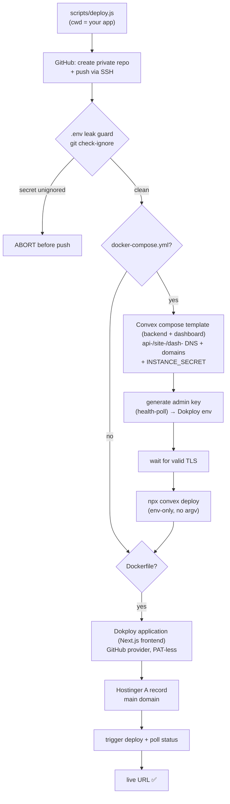

# SI Coder Auto Deploy (legacy `/use-si-coder`)

This skill automates the entire lifecycle of creating a GitHub repository and deploying full-stack apps to a Dokploy server via the single monolithic `scripts/deploy.js`. It is the original one-shot pipeline; the modular `/sc-*` skills (`/sc-all`, `/sc-dokploy`, `/sc-convex`, …) now cover the same ground in surgical pieces, but this monolith remains supported.

## CORE MANDATES FOR THE AI (LEARNED LESSONS)
To guarantee **Zero Human Involvement** (the user just wants to receive the final working URL):
1. **Self-Hosted Convex by Default**: NEVER use Clerk unless explicitly asked. ALWAYS use `@convex-dev/auth`. ALWAYS include a `docker-compose.yml` for self-hosting Convex alongside the frontend.
2. **Build Safety**: Do NOT run `npx convex codegen` inside the `Dockerfile`. You MUST generate the types locally (`npx convex dev --once`) and commit the `convex/_generated` folder to Git before deploying.
3. **No Prompts / Dependency Hell**: Always use `npm install --yes --legacy-peer-deps`. If a scaffolded template is too complex (bloated), wipe it and start fresh with `npx create-next-app` to avoid endless TypeScript errors.
4. **Exact Cloning**: If asked to clone a website, you MUST replicate its actual layout and structure, not just build a generic admin dashboard. Fetch the website to understand its structure.
5. **Dokploy Idempotency**: The deployment script handles existing apps, composes, and domains safely. Do NOT delete or recreate existing domains if Dokploy rejects them (it means they are already configured).
6. **Convex Admin Key Sync**: When generating or rotating a self-hosted Convex admin key, immediately update the Dokploy Compose environment and the repo's local env file so they stay in sync. Use the project's actual env name for that template or app, and do not invent a second secret name.
7. **Clerk MCP for Clerk Apps**: If a target project already uses Clerk, preserve it, do not swap it to `@convex-dev/auth`, and use Clerk MCP (`clerk` at `https://mcp.clerk.com/mcp`) for SDK snippets and integration patterns.

## Pre-requisites
1. **Dokploy Credentials**: Environment variables `DOKPLOY_API_URL` and `DOKPLOY_API_KEY` (usually stored in `~/.bashrc`).
2. **GitHub Credentials**: A GitHub Personal Access Token (PAT) with repository creation permissions, stored in the `GITHUB_TOKEN` environment variable.
3. **Hostinger Credentials**: `HOSTINGER_API_TOKEN` (optional but recommended for DNS automation). The script reads this directly from the environment.
4. **SSH Keys**: The machine must have SSH access to GitHub (`git@github.com`) configured for pushing code.

See the repo's `.env.example` for the full setup checklist.

## Workflow

When the user asks to deploy a project:

1. **Verify Credentials**: Check for `DOKPLOY_API_URL`, `DOKPLOY_API_KEY`, and `GITHUB_TOKEN` (and `HOSTINGER_API_TOKEN` if DNS automation is wanted).
2. **Docker Compose**: Ensure the project has a `docker-compose.yml` that defines the frontend, backend (Convex DB), etc. (Or at least a Dockerfile for simple apps).
3. **Execute Deployment Script**: Run the Node.js deployment script from inside the project directory.



## Features
- **Zero-Human Intervention**: The script creates repos, pushes code, creates projects, and triggers deployments automatically.
- **Hostinger DNS Automation**: If `HOSTINGER_API_TOKEN` is present in the environment, the script automatically adds `A` records for your main domain and Convex backend subdomains (`api-`, `dash-`, `site-`) pointing to your Dokploy server.
- **Self-Hosted Convex DB**: Automatically deploys a production-ready Convex self-hosted DB using the Dokploy `convex` compose template.

## Invocation

> **Secrets are NEVER passed on the command line.** `DOKPLOY_API_URL`, `DOKPLOY_API_KEY`, `GITHUB_TOKEN` (and optional `HOSTINGER_API_TOKEN`) are read **only from the environment** — never from argv — so they cannot leak via `ps aux` / `/proc/<pid>/cmdline`. Export them in `~/.bashrc` (or run `/sc-onboarding`). Only the **non-secret** project/app/domain values are written on the command line, via flags.

`scripts/deploy.js` lives at the **repo root** (it imports `../lib/*`), so run it from a clone of `si-coder-agent`. Point it at your project directory with `cd` first (it operates on the current working directory's git repo).

```bash
# 1. Secrets stay in env (exported once in ~/.bashrc):
#    export DOKPLOY_API_URL=...  DOKPLOY_API_KEY=...  GITHUB_TOKEN=...
#    (optional) export HOSTINGER_API_TOKEN=...

# 2. cd into the app you want to deploy:
cd ~/projects/<app_name>

# 3. Run the monolith from your si-coder-agent checkout — only NON-secret flags on argv:
node ~/path/to/si-coder-agent/scripts/deploy.js \
  --project "<PROJECT_NAME>" --app "<APP_NAME>" --domain "<DOMAIN>"
```

The only **command-line** values you write by hand are `<PROJECT_NAME>`, `<APP_NAME>`, and `<DOMAIN>` — no secret occupies an argv slot. Two **opt-in** behaviors are gated behind environment variables (both unset by default): `SC_ALLOW_FORCE_PUSH=1` appends `--force` to the `git push` (deploy.js ~541/615), and `SC_ALLOW_REMOTE_REWRITE=1` permits rewriting a pre-existing local `origin` remote that points elsewhere (deploy.js ~578). Leave both unset unless you specifically need them.

Flags (all non-secret):

```
node scripts/deploy.js --project <PROJECT_NAME> --app <APP_NAME> [--domain <DOMAIN>]
# bare positionals also accepted (still no secrets): <PROJECT_NAME> <APP_NAME> [DOMAIN]
```

### Example

```bash
cd ~/projects/my-saas-app
node ~/path/to/si-coder-agent/scripts/deploy.js \
  --project "my-project" --app "my-saas-app" --domain "myapp.example.com"
```

## How the script works
The script will:
1. Contact the GitHub API using `GITHUB_TOKEN` to create a new private repository named `APP_NAME` (skips if it already exists).
2. Initialize local Git, commit files (including `convex/_generated`), and `git push` to GitHub via SSH (`git@github.com:<owner>/<app>.git`).
3. Fetch Dokploy projects to find or create `PROJECT_NAME`.
4. Auto-detect `docker-compose.yml` / `Dockerfile`. If a compose file exists, it deploys the Dokploy **`convex` compose template** (the Convex backend + dashboard — **not** the frontend) and sets the `api-`/`site-`/`dash-` DNS + backend domains **before** deploying the Convex schema. If a `Dockerfile` exists, it creates/updates a standard **Dokploy Application** — this is the path by which the **Next.js frontend deploys separately** (its main-domain DNS is set here).
5. Bind the Dokploy application to its source **without ever embedding a PAT in the git URL**: it first looks for a configured **Dokploy GitHub provider** (`/github.githubProviders`) and uses `application.saveGithubProvider` + `sourceType: "github"`. If no provider exists, it falls back to a **PAT-less public git URL** (`https://github.com/<owner>/<repo>.git`, `sourceType: "git"`) and warns that private repos then need an SSH deploy key / GitHub App configured in Dokploy. A PAT is never persisted into `customGitUrl`.
6. Create the `DOMAIN` (and the `api-/site-/dash-` backend domains for the compose path) in Dokploy, silently skipping any that already exist, then prune stale / `*.traefik.me` domains.
7. Sync the compose env (without rotating existing Convex secrets), auto-generate the Convex admin key from the running backend container, push the Convex schema via `npx convex deploy`, then trigger the application deployment and poll until `done` / `error`.

### Secret-leak guards (before `git add .`)

Before the script ever stages your project, it runs **two** guards. The first, `ensureGitignoreSafety`, runs before `git init` and inspects the **repo root**:

- Ensures `.gitignore` exists and covers `.env`, `.env.*` (re-including `.env.example`), `node_modules`, `.next`, `.DS_Store`.
- **Asks git itself** (`git check-ignore`) whether each discovered `.env*` file is actually ignored, so it honors negations, nested `.gitignore` files, and your global excludes — not a hand-rolled matcher. A trailing `!.env` / `!.env.*` re-include (which git's last-match-wins precedence would use to **un-ignore** your secrets) causes a hard abort.
- Hard-aborts on any unignored `.env` / `.env.<suffix>` file at the project root (other than `.env.example`).
- For **other** common secret files at the repo root (`id_rsa`, `*.pem`, `*.p12`, `*.key`, `serviceAccount*.json`, …) it **warns but does not abort** — naming conventions vary, so you decide. If sensitive, add them to `.gitignore` before deploying.

The second guard, `scanNestedDotenvLeaks`, runs **after** `git init` (so `git check-ignore` is authoritative) and walks the **whole tree** — because `git add .` stages every directory, not just the root (it skips `.git/` and `node_modules/`):

- **HARD-ABORTS** on any unignored nested `.env` / `.env.*` (e.g. `apps/web/.env`, `convex/.env.local`) — the same dotenv rule as the root guard, but tree-wide.
- **WARNS** (does not abort) on nested non-dotenv secrets (`id_rsa`, `*.pem`, `*.key`, `serviceAccount*.json`, …) that `git add .` would otherwise stage. Add them to `.gitignore` if sensitive.

### Admin Key Sync Rule

If the deployment includes a self-hosted Convex backend, always generate or rotate the admin key from the running backend container, then update both places before finishing the task:
- Dokploy Compose service environment for the Convex backend
- Local repo env file used for debugging and dashboard access

Never leave the backend container, Dokploy env, and local env file on different admin key values. If the dashboard rejects the key, assume the key belongs to a different backend instance and regenerate it from the active backend container.

## Convex Self-Hosted Authentication (`@convex-dev/auth`)

Full `@convex-dev/auth` setup — generating `JWT_PRIVATE_KEY` + `JWKS`, the required backend env-var table, the PBKDF2 password-hashing override (Scrypt/bcrypt time out on the Dokploy proxy), the `ConvexClientProvider` "route `auth:*` via HTTP" pattern, the `NEXT_PUBLIC_CONVEX_URL` build-time Dockerfile gotcha, and "Connection lost while action was in flight" diagnosis — is owned by **`/sc-convex`**. Use its `scripts/set-auth-env.js --generate` (automated admin REST `/api/update_environment_variables`) instead of hand-rolling keys or a raw `curl`.

**Caveat (progressive disclosure):** `scripts/deploy.js` sets `INSTANCE_SECRET`, `INSTANCE_NAME`, `CONVEX_CLOUD_ORIGIN`, `CONVEX_SITE_ORIGIN`, and the Convex admin key on the compose env, but it does **NOT** auto-set `JWT_PRIVATE_KEY` / `JWKS`. A project using `@convex-dev/auth` will crash on `signIn` ("Connection lost while action was in flight") until you set those two on the backend via `/sc-convex`.

Auth file layout (kept here because `/sc-convex` doesn't spell it out):

```
convex/
├── auth.ts          # convexAuth({ providers: [Password({...})] }) → exports auth, signIn, signOut, store, isAuthenticated
├── auth.config.ts   # { providers: [{ domain: process.env.CONVEX_SITE_URL }] }
├── http.ts          # httpRouter + auth.addHttpRoutes(http)
└── schema.ts        # defineSchema({ ...authTables, ...featureTables })
```
